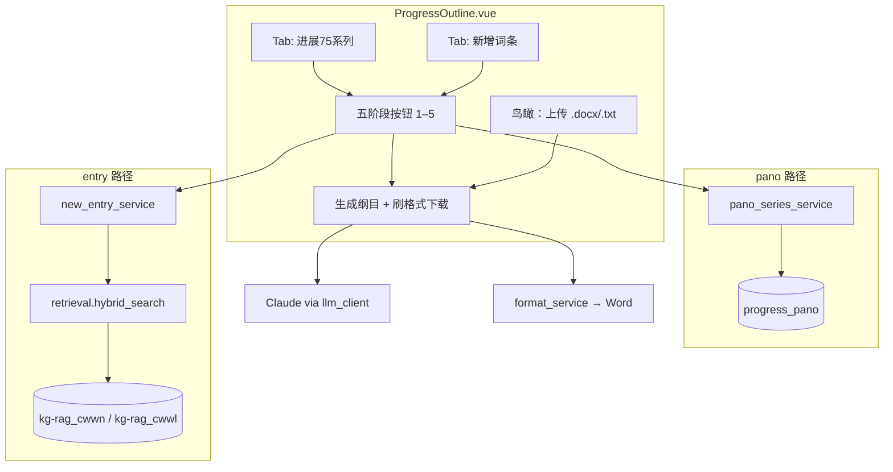
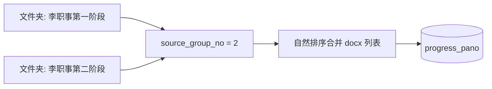
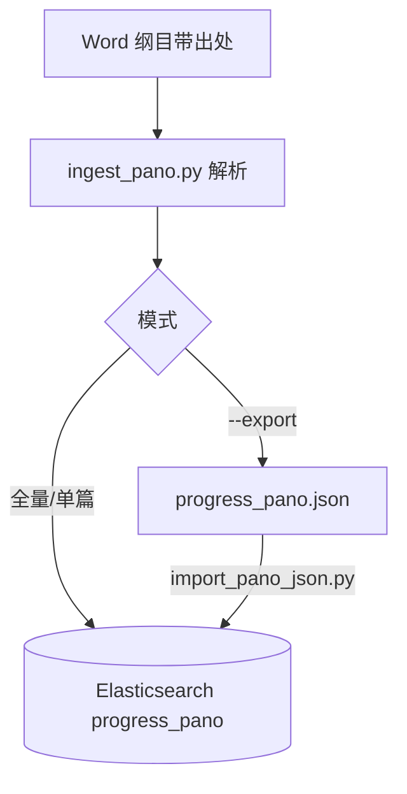
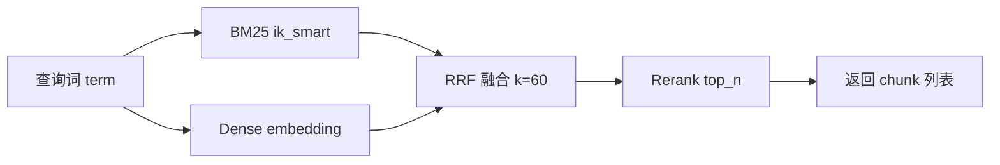
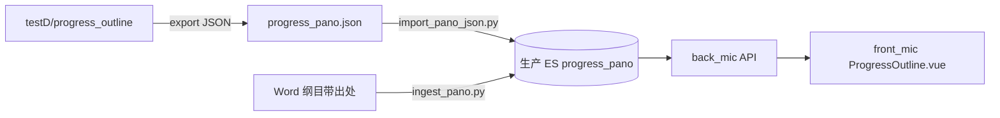

# progress_outline 模块设计文档

> **主恢复的神圣启示进展** — 纲目检索、生成与格式化功能的技术说明。  
> 代码根目录：`back_mic/backend/features/progress_outline/`  
> 入库脚本：`back_mic/backend/scripts/progress_outline/`  
> 前端页面：`front_mic/frontend/src/features/progress_outline/ProgressOutline.vue`

---

## 1. 产品定位

本模块面向两类使用场景，共用同一套 **五阶段** 按钮 UI 与 **纲目生成 / 刷格式下载** 流水线，但数据来源与检索方式不同。

| 维度 | **进展75系列（pano）** | **新增词条（entry）** |
|------|------------------------|------------------------|
| Tab 名称 | 进展75系列 | 新增词条 |
| 用户输入 | 系列编号 `series_no`（下拉） | 词条名称 `term` + 可选 `top_k` |
| 检索对象 | ES 索引 `progress_pano` 中已入库的 Word 纲目 | KG-RAG 职事语料索引（`kg-rag_cwwn` / `kg-rag_cwwl`） |
| 检索方式 | 精确过滤：`series_no` + `source_group_no`，按 `article_no` 排序 | 混合检索：BM25 + 向量 + RRF + Rerank，按阶段年份过滤 |
| 结果形态 | 文章列表，每篇含 `outline[]`、`ministry_excerpt[]` | chunk 列表，每条形如出处 + 正文 |
| 典型用途 | 按系列、按阶段浏览已有进展纲目，再生成/导出 | 按词条跨语料检索相关材料，再生成专题纲目 |



**尚未实现**：检索结果的 **分组 / 聚类展示**（如按书卷、按篇次分组）。当前前端仅以可折叠列表逐条展示。

---

## 2. 五阶段 `source_group_no` 与合并规则

全模块统一使用 **`source_group_no` ∈ {1, 2, 3, 4, 5}**（API 校验 `ge=1, le=5`）。  
与早期 testD 原型（6 阶段、李职事一/二阶段拆分）不同，**生产实现将李常受职事第一阶段与第二阶段合并为 `no=2`**。

### 2.1 阶段对照表

| `source_group_no` | 展示标签（API `source_group_label`） | pano：入库文件夹匹配 | entry：ES 索引与年份 |
|-------------------|--------------------------------------|----------------------|---------------------|
| 1 | 倪柝声弟兄职事 | `倪柝声弟兄职事` | `kg-rag_cwwn`，无年份过滤 |
| 2 | 李常受弟兄职事第一阶段（1932-1973） | `李常受弟兄职事第一阶段` **或** `李常受弟兄职事第二阶段` | `kg-rag_cwwl`，`year` 1932–1973 |
| 3 | 李常受弟兄职事第三阶段（1974-1984） | `李常受弟兄职事第三阶段` | `kg-rag_cwwl`，1974–1984 |
| 4 | 李常受弟兄职事第四阶段（1984-1990） | `李常受弟兄职事第四阶段` | `kg-rag_cwwl`，1984–1990 |
| 5 | 李常受弟兄职事高峰阶段（1990-1997） | `李常受弟兄职事高峰阶段` | `kg-rag_cwwl`，1990–1997 |

### 2.2 pano 入库合并逻辑

入库脚本 `ingest_pano.py` 中 `SOURCE_GROUP_MAP` 将两个文件夹名映射到同一 `no=2`：

```text
"李常受弟兄职事第一阶段" → 2
"李常受弟兄职事第二阶段" → 2   # 与第一阶段合并
```

同一系列下，若存在多个文件夹命中同一 `source_group_no`，脚本会：

1. 收集各文件夹下全部「纲目带出处」`.docx`；
2. 按路径自然排序后 **顺序编号** `seq_no`（1, 2, 3, …）；
3. 写入 ES 的 `source_group_title` 使用规范名 `SOURCE_GROUP_TITLE_CANONICAL[2]` = `"李常受弟兄职事第一阶段"`，与磁盘文件夹原名无关。



### 2.3 entry 检索与阶段对齐

`new_entry_service.STAGE_CONFIG` 与上表年份区间一致，保证用户点击「贰　李 1932-1973」时，pano 与 entry 语义对齐。

---

## 3. 离线索引管线（ingest）

### 3.1 数据源要求

- 根目录下为 **系列文件夹**，命名形如：`{编号} {系列名}——{篇数}篇`（正则 `SERIES_FOLDER_RE`）。
- 系列下为 **来源分组文件夹**（见 §2.1）。
- 只处理 **「纲目带出处」** 版本 Word：
  - 文件名含 `纲目带出处`，或
  - 文档内红色字体段落数 ≥ `RED_PARA_THRESHOLD`（4）的防火墙判定。
- 消息文件命名：`msg. {篇号} {题目}[纲目带出处].docx`（`MSG_FILE_RE`）。

### 3.2 解析规则

| 区块 | 规则 |
|------|------|
| `metadata` | 「读经：」之前的段落（无读经标记时全文作 metadata） |
| `outline` | 「读经：」至「职事信息摘录」之间；按段落解析 |
| `outline[].type` | `bible_reading` / `ot1`–`ot7`，由行首标记正则判定 |
| `outline[].text` | 段落中非红色 run 拼接 |
| `outline[].source` | 段落中 **红色 run** 拼接（出处引用）；无红色则为 `null` |
| `ministry_excerpt` | 当前入库为空数组 `[]`（预留字段） |

**要点**：`outline.source` 仅存 ES，供后续扩展；前端 `ProgressOutline.vue` 目前只展示 `line.text`，不渲染出处。

### 3.3 文档 `_id` 规则

```text
progress_pano-{series_no}-{source_group_no}-{seq_no}
```

示例：`progress_pano-1-2-15` = 系列 1、阶段 2、该阶段下第 15 个 docx（合并排序后）。

### 3.4 运行命令

在 `back_mic/backend` 目录：

```bash
# Word → ES 全量入库（默认重建索引）
python scripts/progress_outline/ingest_pano.py --source-dir "D:\path\to\进展Word根目录"

# 追加模式（不删索引）
python scripts/progress_outline/ingest_pano.py --source-dir "..." --no-recreate

# Word → JSON 导出（无需 ES）
python scripts/progress_outline/ingest_pano.py --source-dir "..." --export

# JSON → ES 导入（默认重建索引）
python scripts/progress_outline/import_pano_json.py scripts/progress_outline/progress_pano.json

# 单篇重入库
python scripts/progress_outline/ingest_pano.py --source-dir "..." --doc-id progress_pano-1-1-1
```

日志：`scripts/progress_outline/ingest_pano.log`。



---

## 4. Elasticsearch 索引 `progress_pano`

### 4.1 Mapping（`INDEX_MAPPING`）

| 字段 | 类型 | 说明 |
|------|------|------|
| `series_no` | integer | 系列编号 |
| `series_title` | keyword | 系列名称 |
| `source_group_no` | integer | 阶段 1–5 |
| `source_group_title` | keyword | 规范分组标题 |
| `article_no` | integer | 篇号（来自文件名 `msg. N`） |
| `title` | keyword | 篇题，如 `第一篇　…` |
| `metadata` | text | 篇前元信息 |
| `outline` | **nested** | 纲目行数组 |
| `outline.type` | keyword | 层级类型 |
| `outline.text` | text | 纲目正文 |
| `outline.source` | keyword | 红色出处（可空） |
| `ministry_excerpt` | **nested** | `{ text }`，当前多为空 |

### 4.2 查询模式（运行时）

**系列列表**（`list_series`）：`terms` 聚合 `series_no` + `top_hits` 取 `series_title`。

**文章检索**（`search_articles`）：

```json
{
  "query": {
    "bool": {
      "must": [
        { "term": { "series_no": <series_no> } },
        { "term": { "source_group_no": <source_group_no> } }
      ]
    }
  },
  "size": 5000,
  "sort": [{ "article_no": "asc" }]
}
```

---

## 5. 后端文件结构

```
back_mic/backend/
├── features/progress_outline/
│   ├── DESIGN.md              # 本文档
│   ├── router.py              # FastAPI 路由（含 /api/pano、/api/entry 别名）
│   ├── pano_series_service.py # progress_pano 查询与 plain_text 拼接
│   ├── new_entry_service.py   # 词条检索编排 + STAGE_CONFIG
│   ├── retrieval.py           # BM25 + Dense + RRF + Rerank
│   ├── llm_client.py          # Claude 调用与用量
│   ├── prompts.py             # 四类纲目 prompt 模板
│   ├── format_service.py      # 中文纲目刷格式 → docx
│   ├── token_utils.py         # Token 估算
│   └── 中文纲目模板.docx       # format_service 样式模板
└── scripts/progress_outline/
    ├── ingest_pano.py         # Word 解析 / 入库 / 导出 JSON
    ├── import_pano_json.py    # JSON → ES 薄封装
    ├── README.md              # 入库快速说明
    └── progress_pano.json     # 可选：离线导出快照（体积大，常不入库）
```

依赖主站基础设施：

- `es_config.es` — Elasticsearch 客户端
- `kg_rag.embedding_adapter.get_embedding` — 稠密向量（profile `kg_rag`）
- `ai_search.reranker_service.rerank` — 重排序
- `user.token.test_token` — Bearer 鉴权

`main.py` 注册三个 router：

```python
app.include_router(progress_outline_router)      # /api/progress/*
app.include_router(progress_outline_pano_router) # /api/pano/*
app.include_router(progress_outline_entry_router) # /api/entry/*
```

---

## 6. API 列表

所有接口需 `Authorization: Bearer <token>`（`test_token`）。

### 6.1 主路由 `/api/progress`

| 方法 | 路径 | 说明 |
|------|------|------|
| GET | `/series-list` | 系列编号列表 |
| POST | `/pano/search` | 进展文章检索 |
| POST | `/entry/search` | 词条混合检索 |
| POST | `/upload-text` | 上传 `.docx`/`.txt`（鸟瞰入口） |
| POST | `/pano/generate/segment` | 进展 · 分段纲目 |
| POST | `/pano/generate/overview` | 进展 · 鸟瞰纲目 |
| POST | `/entry/generate/segment` | 词条 · 分段纲目 |
| POST | `/entry/generate/overview` | 词条 · 鸟瞰纲目 |
| POST | `/format_download` | 生成结果刷格式下载 Word |

### 6.2 别名路由（与主路由等价部分）

| 方法 | 路径 | 等价于 |
|------|------|--------|
| GET | `/api/pano/series-list` | `GET /api/progress/series-list` |
| POST | `/api/pano/articles` | `POST /api/progress/pano/search` |
| POST | `/api/entry/search` | `POST /api/progress/entry/search` |

生成、上传、格式化 **仅** 挂在 `/api/progress/*`，无 pano/entry 别名。

### 6.3 请求 / 响应要点

**`POST /pano/search`**

```json
// Request
{ "series_no": 1, "source_group_no": 2 }

// Response（节选）
{
  "articles": [{ "id", "article_no", "title", "outline", "ministry_excerpt", ... }],
  "count": 12,
  "estimated_tokens": 45000,
  "estimated_tokens": 12000,
  "plain_text": "...",
  "source_group_label": "李常受弟兄职事第一阶段（1932-1973）"
}
```

**`POST /entry/search`**

```json
// Request
{ "term": "基督", "source_group_no": 1, "top_k": 80 }

// Response（节选）
{
  "items": [{ "chunk_id", "source_zh", "text", "book_title", "year", ... }],
  "count": 80,
  "plain_text": "...",
  "source_group_label": "...",
  "index": "kg-rag_cwwn"
}
```

**`POST /*/generate/*`**

```json
// Request
{ "content": "<plain_text>", "term": "基督", "groups": [...] }  // term 仅 entry；分段生成可传 groups

// Response
{ "text": "...", "usage": { "model", "input_tokens", "output_tokens", "cost_usd" } }
```

---

## 7. `retrieval.py` 检索管线

对齐 testD 原语，供 `new_entry_service` 调用。



| 步骤 | 函数 | 参数 / 说明 |
|------|------|-------------|
| BM25 | `bm25_search` | `match` on `text`，analyzer `ik_smart`；可选 `year` range filter |
| 稠密 | `dense_search` | `knn` on `embedding`，`num_candidates = max(100, top_k*3)` |
| 融合 | `rrf_merge` | Reciprocal Rank Fusion，`RRF_K = 60` |
| 重排 | `hybrid_search` → `rerank` | 对 RRF 结果全文 rerank，取 `top_k` |

默认各取 `BM25_TOP_K = DENSE_TOP_K = 30`，`hybrid_search` 内 `fetch_k = max(30, top_k)`。

返回字段（`_source`）：`chunk_id`, `text`, `book_title`, `author`, `source_zh`, `message_number`, `message_title`, `section_title`, `paragraph_type`, `tokens`, `en`, `source_en`, `year`。

失败降级：BM25 / Embedding / ES 异常时记录 warning 并返回空列表或部分结果，不抛至 HTTP 层（entry 空结果仍 200）。

---

## 8. 前端 `ProgressOutline.vue`

- 路由：`/progress-outline`（`requiresAuth: true`）
- API 基址：`VITE_API_BASE` + `/api/progress/...`（**未使用** `/api/pano`、`/api/entry` 别名，但后端已提供兼容）

### 8.1 界面结构

1. **Tab**：`pano` | `entry`
2. **输入区**：系列下拉 或 词条 + `top_k`
3. **阶段按钮**：五阶段 + 「鸟瞰」上传
4. **元信息**：材料 Token 估算（仅供参考）
5. **生成**：分段纲目 / 鸟瞰纲目
6. **结果区**：生成文本 + 刷格式下载；检索结果折叠列表

### 8.2 五阶段按钮（硬编码，与后端一致）

```javascript
{ no: 1, short: "壹　倪柝声" }
{ no: 2, short: "贰　李 1932-1973" }   // 一+二阶段合并
{ no: 3, short: "叁　李 1974-1984" }
{ no: 4, short: "肆　李 1984-1990" }
{ no: 5, short: "伍　李 1990-1997" }
```

### 8.3 关键交互

| 操作 | API |
|------|-----|
| 加载系列 | `GET /api/progress/series-list` |
| 阶段检索 pano | `POST /api/progress/pano/search` |
| 阶段检索 entry | `POST /api/progress/entry/search` |
| 鸟瞰上传 | `POST /api/progress/upload-text` |
| 生成 | `POST /api/progress/{pano\|entry}/generate/{segment\|overview}` |
| 下载 | `POST /api/progress/format_download` |

生成进行中会 `locked` 检索区，防止并发操作。  
pano 纲目展示按 `outline.type` 缩进；**不显示** `outline.source`。

---

## 9. 与 testD 的关系

`testD/progress_outline/` 为本功能的 **独立原型 / 验收环境**，结构与生产高度相似，便于本地联调与数据导出。

| 项目 | testD 原型 | back_mic 生产 |
|------|------------|----------------|
| 后端位置 | `testD/progress_outline/backend/` | `back_mic/backend/features/progress_outline/` |
| 入库脚本 | `testD/progress_outline/scripts/` | `back_mic/backend/scripts/progress_outline/` |
| 前端 | `MainView.vue`（Vite 独立应用） | `ProgressOutline.vue`（嵌入主站 `front_mic`） |
| 阶段数 | **6** 阶段（李一/李二分开） | **5** 阶段（李一+李二 → `no=2`） |
| entry 年份 | 1932-1960 / 1961-1973 / … | 1932-1973 合并为阶段 2 |
| ES 客户端 | 本地 `es_client.py` | 主站 `es_config` |
| Embedding / Rerank | 本地 adapter | `kg_rag` + `ai_search` |
| API 别名 | `/api/pano`、`/api/entry` | 同左，另挂主站鉴权 |
| `/api/progress/stages` | 有（返回 6 按钮配置） | **无**（前端硬编码 5 阶段） |
| 分组展示 | 无 | 无（均未实现） |

**迁移路径**：在 testD 导出 `progress_pano.json` 后，可用生产环境 `import_pano_json.py` 导入；若 JSON 由 **5 阶段合并规则** 的 `ingest_pano.py` 生成，则与生产索引一致。testD 旧版 6 阶段 JSON 需重新用生产脚本导出。



---

## 10. 运维检查清单

### 10.1 环境变量

- [ ] Elasticsearch 连接（`back_mic/backend/.env` → `es_config`）
- [ ] `CLAUDE_API_KEY` 或 `ANTHROPIC_API_KEY`（生成纲目、精确 Token 计数）
- [ ] KG-RAG 向量服务可达（entry 稠密检索）
- [ ] Reranker 服务可达（entry 重排）

### 10.2 索引与数据

- [ ] 索引 `progress_pano` 存在且 mapping 含 `outline.source` nested 字段
- [ ] `GET /api/progress/series-list` 返回非空 `series`（否则前端提示「系列数据暂不可用」）
- [ ] 阶段 2 文档 `_id` 中第三段为 `2`，且 `source_group_title` 为规范名
- [ ] entry 索引 `kg-rag_cwwn`、`kg-rag_cwwl` 存在且含 `embedding`、`year` 字段

### 10.3 入库验证

```bash
cd back_mic/backend
python scripts/progress_outline/ingest_pano.py --source-dir "<根目录>" --export
# 检查日志篇数、系列统计
python scripts/progress_outline/import_pano_json.py scripts/progress_outline/progress_pano.json
```

- [ ] `ingest_pano.log` 无大量跳过文件（非「纲目带出处」会被 `should_skip_file` 过滤）
- [ ] 抽检 ES 文档：`outline[].source` 在含红色出处的篇次非空
- [ ] 单篇修复：`--doc-id progress_pano-x-y-z` 可重跑

### 10.4 API 冒烟

- [ ] `GET /api/progress/series-list` — 200
- [ ] `POST /api/progress/pano/search` — 有 `articles` 且含 `groups` / `n_groups`
- [ ] `POST /api/progress/entry/search` — 有 `items` 且含 `groups` / `n_groups`
- [ ] `POST /api/pano/articles`、`POST /api/entry/search` 别名与主路由结果一致
- [ ] `POST /api/progress/pano/generate/segment` — 返回 `text` + `usage`
- [ ] `POST /api/progress/format_download` — 下载 `.docx` 且样式正常

### 10.5 前端

- [ ] 访问 `/progress-outline` 已登录
- [ ] 检索结果按主题分组展示（标题 + 负担 + 可折叠篇目/段落）
- [ ] 分段纲目按组并行生成，结果以 `---` 分隔
- [ ] 生成中检索区锁定；完成后可刷格式下载
- [ ] `features/progress_outline/中文纲目模板.docx` 随部署存在（format 依赖）

### 10.6 主题分组（已实现）

检索完成后，后端调用 LLM 将结果按主题分为 `n_groups ≈ round(count × 1.5 / 10)` 组：

- **进展篇目**：`pano/search` 返回 `groups`（含 `title`、`burden`、`articles`、`plain_text`）
- **新增词条**：`entry/search` 同样返回 `groups`（含 `items`）
- 匹配键分别为 ES `_id` 与 `chunk_id`；分组失败时全部归入一组（fallback）
- **分段生成**：前端传 `groups[].plain_text`，后端 `asyncio.gather` 并行生成，`\n\n---\n\n` 拼接
- **鸟瞰生成**：仍使用全量 `plain_text`，不分组

### 10.7 已知限制

- pano 前端不展示 `outline.source`
- `ministry_excerpt` 入库为空，摘录需后续 parser 扩展
- `prompts.py` 为占位模板，生产提示词可持续迭代
- pano 单次最多返回 5000 篇（`size: 5000`）

---

## 附录：Token 估算

`token_utils.estimate_tokens`：优先 Claude `count_tokens`，失败则 CJK 启发式。检索结果回传 `estimated_tokens` 供前端参考。

生成纲目不再限制输出长度；分段时各组按自身 `plain_text` 由模型自然展开详略。

`pano_series_service.articles_to_plain_text` / `new_entry_service.entries_to_plain_text` 将检索结果拼成生成用纯文本，层级缩进由 `outline_indent` / 前端 `indentMap` 保持一致。
