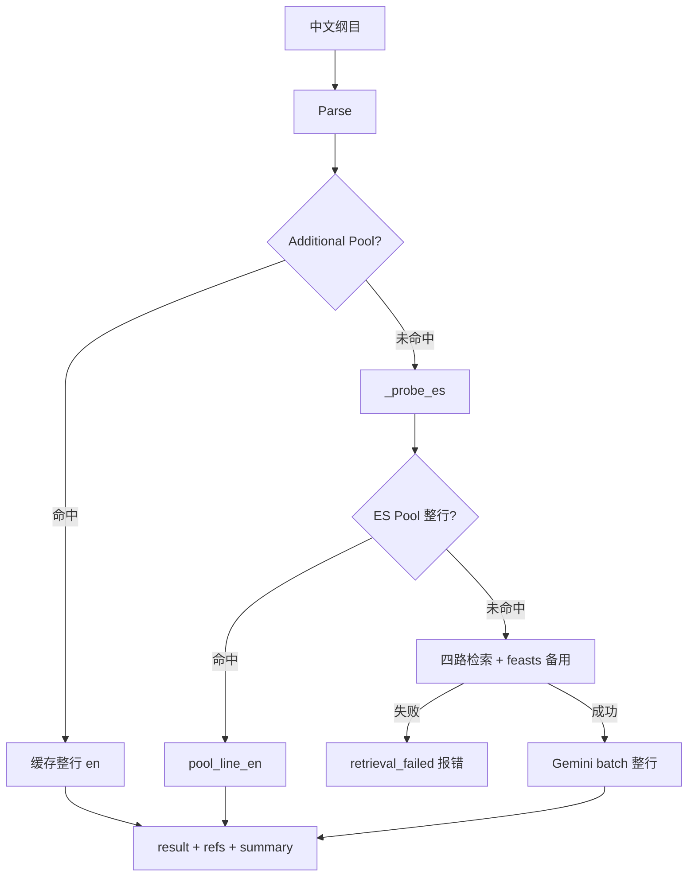

# 增强式翻译（Enhanced Translate）完整设计文档

> 面向学生与 AI 辅助开发者。读完本文档后，应能理解每一个设计决策的原因，并能从零复刻同等功能。

---

## 一、产品定位与核心问题

### 1.1 要解决什么问题

职事文学（Watchman Nee / Witness Lee 著作）有大量固定术语和句式，已有官方英译本。如果直接用通用 LLM 翻译中文纲目，会出现两类问题：

1. **术语不一致**：LLM 自由发挥，同一个词每次译法不同，与已有英译本不符。
2. **成本与延迟**：同一批纲目反复翻译，每次都调用 Gemini，既浪费钱又慢。

增强式翻译的核心思路是：**先查，再译**。能从语料库里直接查到的，不调用 Gemini；查不到的，把相关语料作为参考一起送给 Gemini，让它在正确的术语框架内翻译。

### 1.2 输入与输出

**中翻英（`enhanced_translate`，`direction=zh2en`）**

- **输入**：简体中文纲目，多行，每行 `[序号前缀][正文][读经后缀]`
- **输出**：英文纲目、每行参考语料、统计摘要

**英翻中（`enhanced_translate_en2zh`，`direction=en2zh`）**

- **输入**：英文纲目，结构与中翻英对称（序号、分号子句、读经后缀）
- **输出**：中文纲目、每行参考语料、统计摘要

例（中翻英输入）：
```
一	神圣的生命；基督的经历—约一1：
二	职事的路
壹	神的经纶
```

**输出**（两个方向共用 API 结构）：
- 翻译结果全文（`result`，行对齐）
- 每行参考语料明细（`refs`，供审校）
- 统计摘要（`summary`：命中率、Gemini token 与费用等）

---

## 二、整体架构：四个阶段

整个翻译流程分为严格的四个阶段，**前三个阶段不调用 Gemini**：

```
阶段一：解析（Parse）
    每行拆成 prefix / body / suffix
    判断行类型 outline / reference

阶段二：查缓存（Cache Lookup）
    两个 Pool 按优先级短路

阶段三：检索（Retrieve）
    未命中 Pool 的行，做行级 ES 检索（四路并行 + RRF + rerank top1）

阶段四：翻译与组装（Translate & Assemble）
    需要 batch 的行调用 Gemini 批量翻译（整行送入，含 prefix+body+suffix）
    Pool / 缓存命中行直接输出，不调用 Gemini
```

**2026-06 重要变更**：已移除 `_translate_suffix`、`_zh_line_for_batch`；读经后缀随整行一并送入 Gemini 或由 Pool 整行返回。检索失败（`retrieval_failed`）时**整单报错**，不再无参考硬译。

**双向支持**：`enhanced_translate`（中→英）与 `enhanced_translate_en2zh`（英→中）共用解析、组装与前端 UI，检索与 Pool 查询字段对称切换（见 §5.3）。

---

## 三、阶段一：行解析（完整详解）

### 3.1 一行纲目的完整结构

```
[prefix]        [body]                    [suffix]
一\t            神圣的生命；基督的经历     —约一1：
壹\t            神的经纶
(一)\t          召会的建造                —太十六18：
```

| 部分 | 定义 | 英文处理 |
|------|------|----------|
| `prefix` | 行首序号 + 紧跟的 Tab 或全角空格 | 查 `_PREFIX_TO_EN` 规则表，不走 Gemini |
| `body` | prefix 之后、suffix 之前的正文 | 走 Pool → 检索 → Gemini 流程 |
| `suffix` | 行末读经标注，以 `—` 开头 | **不再单独 Gemini**；随整行送入 batch 或由 Pool 整行返回 |

---

### 3.2 所有正则与变量定义（逐行解释）

#### 3.2.1 `_MINISTERIALIZE_PREFIX_RE` — 识别序号 prefix

```python
_MINISTERIALIZE_PREFIX_RE = re.compile(
    r"^[壹貳贰參叄叁参肆伍陸陆柒捌玖拾一二三四五六七八九十\da-z（）()]+[\t　]"
)
```

**字符集逐一说明**：

| 字符 | 含义 |
|------|------|
| `壹貳贰參叄叁参肆伍陸陆柒捌玖拾` | 大写中文数字（繁简体兼容：贰/貳 都是二，参/參/叄 都是三，陆/陸 都是六） |
| `一二三四五六七八九十` | 小写中文数字（A/B/C/D/E 级序号） |
| `\d` | 阿拉伯数字 0-9 |
| `a-z` | 小写英文字母（(a)(b)(c) 子序号） |
| `（）()` | 中英文括号（用于 `(一)` `（a）` 等带括号序号） |
| `+` | 以上字符一个或多个 |
| `[\t　]` | Tab（`\t`）或全角空格（`　`，U+3000）—— 必须紧跟才算 prefix |

**匹配示例**：

| 行首内容 | 匹配结果 |
|----------|----------|
| `一\t神圣的生命` | ✅ prefix=`一\t` |
| `壹\t神的经纶` | ✅ prefix=`壹\t` |
| `(一)\t召会` | ✅ prefix=`(一)\t` |
| `1\t生命` | ✅ prefix=`1\t` |
| `a\t信心` | ✅ prefix=`a\t` |
| `神圣的生命` | ❌ 无序号+Tab 结构 |
| `一神圣的生命` | ❌ 序号后无 Tab 或全角空格 |

---

#### 3.2.2 圣经书卷相关变量（读经后缀识别）

**`_BIBLE_BOOKS_66`**：

```python
_BIBLE_BOOKS_66 = (
    "创出利民申书士得撒上撒下王上王下代上代下拉尼斯伯诗箴传歌赛耶哀结但"
    "何珥摩俄拿弥鸿哈番该亚玛"
    "太可路约徒罗林前林后加弗腓西帖前帖后提前提后多门来雅彼前彼后约壹约贰约叁犹启"
    "参"
)
```

66 卷圣经中文缩写字符串，旧约→新约顺序，包含多字缩写（撒上、王下、林前等）。末尾「参」是「参考」。

**`_BIBLE_BOOKS`**：

```python
_BIBLE_BOOKS = "".join(dict.fromkeys(_BIBLE_BOOKS_66))
```

用 `dict.fromkeys` 对字符去重（保持顺序）。「撒上撒下」里的「撒」去重后只保留一个，得到可放入正则字符类 `[...]` 的字符集。

**`_BOOK_PAT`**：

```python
_BOOK_PAT = rf"[{_BIBLE_BOOKS}]{{1,4}}"
```

匹配 1–4 个圣经字符（`{{1,4}}` 是 f-string 里 `{1,4}` 的转义写法）：
- 单字：`约`（约翰）、`太`（马太）
- 双字：`撒上`、`林前`
- 多字：`约壹`、`帖前`

**`_CHAP_PAT`**：

```python
_CHAP_PAT = r"[\d一二三四五六七八九十百～~\-至、\s]+"
```

匹配章节数字部分：

| 字符 | 用途 |
|------|------|
| `\d` | 阿拉伯数字 |
| `一二三四五六七八九十百` | 中文数字（如「三16」） |
| `～~` | 全/半角波浪号（范围，如「一～三」） |
| `\-` | 连字符（如「1-3」） |
| `至` | 汉字范围（如「一至三章」） |
| `、` | 顿号（列举，如「3、4、5」） |
| `\s` | 空白字符 |

**`_REF_UNIT`**：

```python
_REF_UNIT = rf"(?:{_BOOK_PAT})?{_CHAP_PAT}"
```

一个引用单元 = 可选书卷名 + 章节数字。用于多段引用里第二段可省略书卷名的情况（如「约三16；四14」）。

**`_SCRIPTURE_REF_RE`**：

```python
_SCRIPTURE_REF_RE = re.compile(
    rf"(—{_BOOK_PAT}{_CHAP_PAT}(?:[,，；;]{_REF_UNIT})*[：:。]?\s*)$"
)
```

| 部分 | 含义 |
|------|------|
| `—` | 破折号，读经后缀固定开头 |
| `{_BOOK_PAT}` | 第一个书卷名（必须有） |
| `{_CHAP_PAT}` | 第一段章节 |
| `(?:[,，；;]{_REF_UNIT})*` | 零个或多个后续引用，逗号/分号分隔 |
| `[：:。]?` | 可选冒号或句号结尾 |
| `\s*` | 可选尾部空白 |
| `$` | 行末锚点 |

匹配示例：`—约三16：`、`—太五3-12：`、`—林前十五45，约一1：`

**`_PURE_VERSE_RE`**：

```python
_PURE_VERSE_RE = re.compile(r"(—[\d～~\-至、\s\d]+节[。：:]?\s*)$")
```

备用，匹配「—3-5节」这类只有节数无书卷名的情况，在 `_SCRIPTURE_REF_RE` 失败时使用。

---

#### 3.2.3 `_PREFIX_TO_EN` — 序号翻译规则表

```python
_PREFIX_TO_EN = {
    "壹": "I.",   "贰": "II.",   "參": "III.",  "参": "III.",
    "肆": "IV.",  "伍": "V.",    "陆": "VI.",   "陸": "VI.",
    "柒": "VII.", "捌": "VIII.", "玖": "IX.",   "拾": "X.",
    "一": "A.",   "二": "B.",    "三": "C.",    "四": "D.",   "五": "E.",
}
```

- `参` 和 `參` 都映射 `"III."`（简繁体兼容）
- `陆` 和 `陸` 都映射 `"VI."`（简繁体兼容）
- 大写中文数字 → 罗马数字（I. II. III. …）
- 小写中文数字 → 英文字母（A. B. C. …）

---

#### 3.2.4 `_OUTLINE_HEAD_RE` — 判断行类型

```python
_OUTLINE_HEAD_RE = re.compile(
    r"^(?:"
    r"[壹贰叁肆伍陆柒捌一二三四五六七八九十]"
    r"|\d+"
    r"|[a-z]"
    r"|[（(](?:[一二三四五六七八九十]+|\d+|[a-z])[)）]"
    r")"
)
```

四个分支：

| 分支 | 正则 | 匹配示例 |
|------|------|----------|
| 大/小写中文数字 | `[壹贰叁肆伍陆柒捌一二三四五六七八九十]` | `一神圣的生命`、`壹神的经纶` |
| 阿拉伯数字 | `\d+` | `1生命`、`12节` |
| 小写字母 | `[a-z]` | `a信心` |
| 带括号序号 | `[（(](?:[一二三四五六七八九十]+\|\d+\|[a-z])[)）]` | `(一)召会`、`（2）生命`、`(a)信心` |

**注意区别**：
- `_MINISTERIALIZE_PREFIX_RE` → 匹配**整行**开头，含 Tab，用于从整行剥离 prefix
- `_OUTLINE_HEAD_RE` → 匹配**body**开头，无 Tab，用于判断行类型

---

#### 3.2.5 ES Pool 相关变量

**`_POOL_INDICES`**：

```python
_POOL_INDICES = ",".join([
    "life", "cwwn", "cwwl", "others",
    "bib", "foo", "hymn", "feasts",
])
```

官方翻译池的 ES 索引名列表。字段为 `zh` / `en` / `text`，**无** `embedding`，与 `kg-rag_*` 不同。

**`_normalize_pool_text`**：

```python
def _normalize_pool_text(s: str) -> str:
    return normalize_zh(s)
```

等同于 `normalize_zh`（NFKC + 去非字母数字），用于 Pool 全等校验。

---

#### 3.2.6 其他模块级变量

**`_INDICES_DENSE`**（chunk 检索 / exact_match，无 7feasts）：

```python
_INDICES_DENSE = ",".join([
    "kg-rag_cwwl", "kg-rag_life", "kg-rag_cwwn",
    "kg-rag_others", "kg-rag_bib",
])
```

**`_INDICES_BM25`**（= `_POOL_INDICES`，BM25 与 ES Pool 共用）：

```python
_INDICES_BM25 = ",".join([
    "life", "cwwn", "cwwl", "others",
    "bib", "foo", "hymn", "feasts",
])
```

`_RetrievalCtx.index` 默认 `_INDICES_DENSE`；`bm25_index` 默认 `_INDICES_BM25`。

**`MAX_CONTENT_CHARS = 100_000`**：请求体纲目最大字符数，超出直接返回错误。

**`_RERANK_SEM = asyncio.Semaphore(10)`**：rerank 步骤的并发限制，防止同时发出太多 Jina API 请求。

**`_PROMPT_OVERRIDE: str = ""`**：服务级 Prompt 覆盖（进程内内存），由 `POST /update_prompt` 写入。

**`_BATCH_LINE_OUT_RE`**：

```python
_BATCH_LINE_OUT_RE = re.compile(r"^Line\s+(\d+)\s*:\s*(.*)$", re.MULTILINE)
```

用于解析 Gemini batch 输出，匹配 `Line 1: ...`、`Line 2: ...` 格式。`re.MULTILINE` 让 `^` 匹配每行行首。

**Gemini 模型覆盖**（`enhanced_translate_service.py` 模块级，在 import `ai_service` 之后）：

```python
GEMINI_MODEL = "gemini-3.5-flash"
GEMINI_TRANSLATION_FALLBACK_MODEL = "gemini-2.5-flash"
```

---


### 3.3 三个解析函数详解

#### `_find_scripture_suffix(rest: str) -> tuple[str, str]`

```python
def _find_scripture_suffix(rest: str) -> tuple[str, str]:
    matches = list(_SCRIPTURE_REF_RE.finditer(rest))
    if matches:
        m = matches[-1]            # 取最后一个匹配
        return rest[: m.start()], m.group(0)
    m = _PURE_VERSE_RE.search(rest)
    if m:
        return rest[: m.start()], m.group(0)
    return rest, ""
```

**为什么取 `matches[-1]`**：正文里可能含「约」等圣经字符（如「大约」），取最后一个匹配确保是行末的读经标注，而不是正文中的误匹配。

#### `_strip_scripture_suffix(line: str) -> tuple[str, str, str]`

```python
def _strip_scripture_suffix(line: str) -> tuple[str, str, str]:
    text = line
    m = _MINISTERIALIZE_PREFIX_RE.match(text)
    if m:
        prefix = m.group(0)        # 含序号字符 + Tab/全角空格
        rest = text[m.end():]
    else:
        prefix = ""
        rest = text
    body, suffix = _find_scripture_suffix(rest)
    return prefix, body.strip(), suffix
```

完整示例：

| 输入行 | prefix | body | suffix |
|--------|--------|------|--------|
| `一\t神圣的生命—约一1：` | `一\t` | `神圣的生命` | `—约一1：` |
| `壹\t神的经纶` | `壹\t` | `神的经纶` | `""` |
| `神圣的生命；基督的经历` | `""` | `神圣的生命；基督的经历` | `""` |
| `一\t—约一1：` | `一\t` | `""` | `—约一1：`（空 body） |
| `(一)\t召会—太十六18：` | `(一)\t` | `召会` | `—太十六18：` |

#### `_translate_prefix(prefix: str) -> str`

```python
def _translate_prefix(prefix: str) -> str:
    if not prefix:
        return ""
    core = prefix.rstrip("\t　 ")    # 剥离分隔符，只留序号字符
    mapped = _PREFIX_TO_EN.get(core.strip())
    if mapped:
        sep = "\t" if "\t" in prefix else ("　" if "　" in prefix else " ")
        return mapped + sep          # 保留原始分隔符类型
    return prefix                    # 未识别则原样返回
```

**保留分隔符类型**：原来用 Tab 对齐，英文也用 Tab，保证纲目视觉格式不变。

#### `_split_body(body: str) -> list[str]`

```python
def _split_body(body: str) -> list[str]:
    body = (body or "").strip()
    if not body:
        return []
    if "；" in body:
        parts = [p.strip() for p in body.split("；")]
        return [p for p in parts if p]    # 过滤空字符串
    return [body]
```

| body | 子句列表 |
|------|----------|
| `神圣的生命；基督的经历；神圣的性情` | `["神圣的生命", "基督的经历", "神圣的性情"]` |
| `职事的路` | `["职事的路"]` |
| `""` | `[]` |
| `神圣的生命；` | `["神圣的生命"]`（末尾空子句被过滤） |

---

### 3.4 行类型判断：outline vs reference

#### `_detect_line_type(body: str, prefix: str = "") -> str`

```python
def _detect_line_type(body: str, prefix: str = "") -> str:
    if (prefix or "").strip():
        return "outline"
    s = (body or "").lstrip()    # 只去前导空白（lstrip，不是 strip）
    if not s:
        return "reference"
    if _OUTLINE_HEAD_RE.match(s):
        return "outline"
    return "reference"
```

**判断逻辑（两级）**：

| 条件 | 结果 |
|------|------|
| `prefix` 非空（如 `一\t`、`壹\t`） | `"outline"` |
| `body` 为空 | `"reference"` |
| `body` 开头匹配 `_OUTLINE_HEAD_RE` | `"outline"` |
| 其余 | `"reference"` |

**典型示例**：

| 原始行 | prefix | body | line_type |
|--------|--------|------|-----------|
| `一\t神圣的生命` | `一\t` | `神圣的生命` | `outline`（prefix 命中） |
| `壹\t神的经纶` | `壹\t` | `神的经纶` | `outline` |
| `神圣的生命是神自己的生命` | `""` | 同上 | `reference` |
| `一神圣的生命`（无 Tab） | `""` | `一神圣的生命` | `outline`（body 匹配 `_OUTLINE_HEAD_RE`） |

**`line_type` 的用途**：写入 `line_ref_group["line_type"]`，供前端区分样式（`outline` / `reference` 标签），**不影响翻译逻辑**。

**设计说明**：带 ministerialize prefix 的行（`一\t…`）在去掉 prefix 后 body 可能不以序号开头，因此优先用 `prefix` 非空判定为 `outline`，与手工验收「`一\t神圣的生命` → outline」一致。

---

### 3.5 解析阶段完整流程图

```
原始行 line
    │
    ├─ _MINISTERIALIZE_PREFIX_RE.match(line)
    │       命中 → prefix = m.group(0)，rest = line[m.end():]
    │       未命中 → prefix = ""，rest = line
    │
    └─ _find_scripture_suffix(rest)
            先试 _SCRIPTURE_REF_RE.finditer → 取 matches[-1]
            再试 _PURE_VERSE_RE.search
            都失败 → suffix = ""
            → body = rest[:m.start()].strip()，suffix = m.group(0)
                │
                ├─ _translate_prefix(prefix)（解析用，组装不再拼接 en_prefix）
                │
                ├─ _split_body(body) → clauses[]
                │
                └─ _detect_line_type(body, prefix) → "outline" | "reference"
```

---

## 四、阶段二：两个 Pool 的短路逻辑

### 4.1 两个 Pool 的对比

| | Additional Pool | ES Pool（官方翻译池） |
|---|---|---|
| 存储位置 | 本地 `pool.jsonl` 文件 | Elasticsearch（`life`, `cwwn`, `cwwl` 等索引） |
| 数据来源 | 系统自动积累 + 手动导入 | 职事著作官方英译本段落库 |
| 匹配粒度 | **整行**（含 prefix+body+suffix） | **整行**（含 prefix+body+suffix） |
| 匹配键 | `normalize_zh(整行)` 全等 | `match_phrase` + `normalize_zh` 全等 |
| 命中后 | 直接输出缓存译文，跳过检索与 Gemini | 直接输出 Pool 译文，跳过检索与 Gemini |

### 4.2 Additional Pool 详解

**数据结构**（`pool.jsonl` 每行一条 JSON）：
```json
{
  "zh": "一\t生命",
  "en": "A.\tLife",
  "norm_zh": "一生命",
  "saved_at": "2026-06-01T10:00:00Z",
  "source": "enhanced_translate"
}
```

**匹配逻辑**：内存字典 `_pool`，键为 `norm_zh`，O(1) 查询。`normalize_zh` 经 NFKC 统一字符后剥离标点与空白，使「一\t生命」和「一 生命」命中同一条。

**自动回写**：每次翻译后把新翻行按 `norm_zh` 去重写入 `pool.jsonl`，Pool 随使用自动增长。

**为什么含序号**：同一正文在不同序号位置（「一\t生命」vs「二\t生命」）对应不同英文前缀，不能共享缓存。

### 4.3 ES Pool 详解

**统一入口 `_pool_lookup(clause)`**（中翻英，查 `zh` 返回 `en`）：

```python
body = {
    "query": {"match_phrase": {"zh": {"query": clause}}},
    "size": 10,
    "_source": ["zh", "en", "text"],
}
# 遍历 hits：normalize_zh(clause) == normalize_zh(hit_zh) 且 en 非空 → 返回 en
```

**英翻中对称入口 `_pool_lookup_en2zh(clause)`**（查 `en` 返回 `zh`）：

```python
body = {
    "query": {"match_phrase": {"en": {"query": clause}}},
    "size": 10,
    "_source": ["zh", "en", "text"],
}
# 遍历 hits：normalize_zh(clause) == normalize_zh(hit_en) 且 zh 非空 → 返回 zh
```

> 已删除 `_pool_lookup_keyword`、`_pool_lookup_bm25_punct`、`_POOL_KEYWORD_MAX_LEN` 分流逻辑。

**全等校验的原理**：`match_phrase` 可能召回标点/引号变体相近句；`normalize_zh` 经 NFKC 统一后全等是最后一道防线（弯引号、`─`/`—`、`~`/`～` 等差异可对齐）。

### 4.4 两个 Pool 在代码中的位置

```python
# ── 主流程最开头：Additional Pool ──
line_cached_en: dict[int, str] = {}
for i, line in enumerate(lines):
    cached = lookup_line_en(line)     # 整行；英翻中暂复用此接口（后续可扩展反向键）
    if cached:
        line_cached_en[i] = cached

# ── _retrieve_line / _retrieve_line_en2zh 最开头：ES Pool ──
pool_hit = await _pool_lookup(line)           # zh2en → en
# pool_hit = await _pool_lookup_en2zh(line)  # en2zh → zh，存入 prep["pool_line_en"]
if pool_hit is not None:
    return { "needs_batch": False, "pool_line_en": pool_hit, ... }
# 以下才是行级检索（exact / BM25 / dense / clause）
```

**优先级**：Additional Pool > ES Pool > 行级检索 + Gemini

---

## 五、阶段三：行级检索（_retrieve_line / _retrieve_line_en2zh）

只有两个 Pool 都未命中的行才进入这个阶段。检索粒度为**整行**（合并多路命中后 RRF + Rerank 取 **top1** 作为该行唯一参考），不再对每个子句单独 rerank。

### 5.1 `_RetrievalCtx` 数据类

```python
@dataclass
class _RetrievalCtx:
    index: str              # _INDICES_DENSE（kg-rag_*）
    bm25_index: str = ""    # _INDICES_BM25（life,cwwn,...）
    es_enabled: bool = True
    dense_enabled: bool = True
    en_dense_enabled: bool = False   # 英翻中预留，当前未启用 Dense
    warnings: list[str] = field(default_factory=list)
    _es_down_logged: bool = False
```

`create`：检查 `OPENROUTER_API_KEY`，无则 `dense_enabled=False` 并 warning。

`mark_es_down` / `_probe_es` / `_is_es_failure`：行为同前（探测最多 3 次、间隔 3s）。降级后跳过 kg-rag 检索；**ES Pool 查询独立**，不受 `es_enabled` 门控。

### 5.2 中翻英 `_retrieve_line` 流程

```
整行 line（含序号与读经后缀）
 │
 ├─ 1. ES Pool：_pool_lookup(line) → 命中则 needs_batch=False
 │
 ├─ 2. 四路并行（asyncio.gather）：
 │      A) _exact_match(line)          match_phrase on text，size=40，验证 normalize_zh(clause) in normalize_zh(text)
 │      B) _bm25_hits(body)            top_k=40，_filter_en_hits
 │      C) _dense_hits(line)           top_k=40，num_candidates=100，需 OpenRouter
 │      D) 每子句 _clause_retrieval    = _exact_match(clause) + _bm25_hits(clause, 40)
 │
 ├─ 3. _dedupe_hits_by_chunk_id 合并全部 hits
 │
 ├─ 4. 若仍为空：feasts BM25 top50 → rerank top1 → match_kind=retrieved
 │
 ├─ 5. 若仍为空：retrieval_failed=True（主流程报错，不调 Gemini）
 │
 ├─ 6. _enrich_hit_en 补全 en 字段
 │
 ├─ 7. 按 dense_ids 分桶 → rrf_merge(bm25_bucket, dense_bucket) → rerank(body, top1)
 │
 └─ 8. 单行 ref：_build_ref_entry(line_i, 0, ref_clause, top) → deduped_refs 进 Gemini
```

### 5.3 英翻中 `_retrieve_line_en2zh` 流程（对称）

与 §5.2 相同骨架，差异：

| 步骤 | 中翻英 | 英翻中 |
|------|--------|--------|
| ES Pool | `_pool_lookup(line)` → `en` | `_pool_lookup_en2zh(line)` → `zh`（仍存 `pool_line_en` 字段） |
| exact | `_exact_match` on `text` | `_exact_match_en` on `en` |
| BM25 | `_bm25_hits(body)` on `text` + ik_smart | `_bm25_hits_en(body)` on `en` + standard |
| Dense | `_dense_hits(line)` | **无**（不调用 Dense） |
| 子句 | `_clause_retrieval` | `_clause_retrieval_en` |
| 过滤 | `_filter_en_hits` | `_filter_zh_hits` |
| feasts 备用 | `bm25_search(line, feasts, 50)` | `_bm25_hits_en(line, feasts, 50)` |
| RRF | bm25_bucket + dense_bucket | 仅 `rrf_merge(enriched, [])` |
| Gemini 参考块 | `_format_ref_block_for_gemini` | `_format_ref_block_for_gemini_en2zh`（展示 en + zh） |

### 5.4 `_build_ref_entry` — 统一 ref 结构

```python
def _build_ref_entry(line_index, clause_index, clause, hit) -> dict:
```

根据 `hit` 的 `match_kind` 构造统一结构：

| 字段 | 说明 |
|------|------|
| `line_index` | 行索引 |
| `clause_index` | 子句索引（同行多子句时用） |
| `zh` | 子句原文 |
| `match_kind` | `"exact"` / `"retrieved"` / `"none"` |
| `match_type` | `"direct"` / `"reference"` / `"none"` |
| `zh_snippet` | exact 时=子句本身；retrieved 时=chunk text 前200字 |
| `en_snippet` | chunk 的英文译文 |
| `text` | chunk 完整中文原文 |
| `en` | chunk 完整英文译文 |
| `chunk_id` | chunk 唯一标识 |
| `source` / `ch_source` | 中文来源（书名+消息号，经 `_extract_source` 清洗） |
| `en_source` | 英文来源；**API 字段名**为 `en_source`，ES `_source` 中对应字段为 **`source_en`**（如 `"(Life-study of Exodus , msg. 11)"`），**不存在** `en_source` 字段 |

### 5.5 去重与编号

```python
deduped_refs = _dedupe_refs_by_chunk_id(line_refs)
# 同一 chunk 被多子句命中时，只保留第一次出现（按 chunk_id 去重）
# chunk_id 为空的 ref 不参与去重（每个都保留）

deduped_refs = _assign_paragraph_numbers(deduped_refs)
# 给去重后的 refs 编号 paragraph=1,2,3...
# 供 _format_ref_block_for_gemini 用「Paragraph N」引用
```

---

## 六、阶段四：翻译与组装

### 6.1 批量翻译（`_translate_batch` / `_translate_batch_en2zh`）

每批最多 10 行。送入 Gemini 的为 **prep["line"] 整行**（含 prefix、body、读经后缀），不再剥离后缀。

**`contents` 拼装（中翻英）**：

```
[blocks]   Line {pos}: {整行中文}{参考语料块}
+
[extra]    "\n\n" + prompt_extra（ENHANCED_TRANSLATE_PROMPT_SUFFIX 或覆盖值）
+
"\n\nTranslate each line above to English. Output ONLY in this exact format:\n"
Line 1: {english translation}
...
```

**英翻中**：同上结构，使用 `_format_ref_block_for_gemini_en2zh`，结尾为 `Translate each line above to Chinese...`。

> 已移除 `OUTLINE_TRANSLATE_PROMPT_ZH2EN` 拼接；通用纲目规则由 `GEMINI_TRANSLATION_SYSTEM_INSTRUCTION`（system）承担。

**`_parse_batch_translations`**：解析 `Line N:` 输出；缺失行 fallback 为原文行。

**Fallback**：主模型失败试 `GEMINI_TRANSLATION_FALLBACK_MODEL`；仍失败则每行退化为原文占位。

**Token 统计**：batch 级 `cumulative_usage` 汇总 `in_tok` / `out_tok`（`out_tok` 含 `thoughts_token_count`），写入 `summary`，不再按行均摊。

### 6.2 组装（`_assemble_line`）

```python
# 优先级 1：Additional Pool
if cached_en:
    return cached_en, _build_line_ref_group(..., additional_pool_line=True, retrieval_skipped=True)

# 优先级 2：ES Pool（zh2en 为 en；en2zh 为 zh，均存 pool_line_en）
if pool_line_en:
    return pool_line_en, _build_line_ref_group(..., pool_line=True)

# 优先级 3：空 body / needs_batch=False
if not prep["needs_batch"]:
    return line, _build_line_ref_group(...)

# 优先级 4：Gemini batch
return translate_by_line[line_i] or line, _build_line_ref_group(..., gemini_translate=...)
```

不再拼接 `en_prefix` / `en_suffix`；Pool 与 batch 均返回**整行译文**。

### 6.3 并行策略

```python
# 检索阶段：所有行并行
preps = await asyncio.gather(*[_prep_one(i, line) for i, line in enumerate(lines)])

# 翻译阶段：多个 batch chunk 并行（Semaphore(10) 限流）
batch_sem = asyncio.Semaphore(10)
batch_outcomes = await asyncio.gather(*[_run_batch_chunk(chunk) for chunk in chunks])

# 组装阶段：所有行并行
results = await asyncio.gather(*[_assemble_line(...) for prep in preps])
```

### 6.4 Gemini API 调用（`_call_gemini_sync`）

经 `_translate_batch` / `_translate_batch_en2zh` 通过 `asyncio.to_thread` 调用。

**`generate_content` 参数**：

```python
response = gemini_client.models.generate_content(
    model=use_model,
    contents=contents,
    config=_gemini_config(),
)
```

**`_gemini_config()`**：`gemini_translation_generate_config(GEMINI_TRANSLATION_SYSTEM_INSTRUCTION)`：
- `system_instruction`：职事术语表
- `automatic_function_calling.disable=True`
- `max_output_tokens`：默认 32768
- `thinking_level=MINIMAL`（SDK 支持时，降低思考 token）

**模型**：`gemini-3.5-flash` / fallback `gemini-2.5-flash`

**Token 日志**（每次成功调用）：

```
[enhanced_translate] gemini call: model=... in_tok=... out_tok=... think_tok=...
```

`cumulative_usage["out_tok"]` 累加 `candidates_token_count + thoughts_token_count`。

**费用**：`_gemini_cost_usd(in, out) = (in*1.50 + out*9.0) / 1_000_000`

---

## 七、数据结构全景

### 7.1 prep 字典

```python
{
    "line_i": int,
    "line": str,            # 原始行（整行）
    "body": str,            # 去掉 prefix 和 suffix 的正文（解析用）
    "line_type": str,       # "outline" | "reference"
    "line_refs": [...],     # 行级 ref（通常 1 条；Pool 命中为 []）
    "deduped_refs": [...],  # 去重+编号后的 refs（进 Gemini prompt）
    "needs_batch": bool,
    "line_cached_en": str,  # Additional Pool 命中译文（字段名历史保留）
    "pool_line_en": str,    # ES Pool 命中译文（zh2en=en，en2zh=zh）
    "retrieval_failed": bool,
}
```

> 已移除 `suffix`、`en_prefix` 字段。

### 7.2 line_ref_group（API 响应单行）

```python
{
    "line_index": int,
    "original_line": str,
    "line_type": "outline" | "reference",   # _detect_line_type 的结果
    "gemini_translate": str,                # 最终英文译文
    "deduped_refs": [...],
    "line_refs": [...],
    "stats": {
        "pool": int,                 # 子句级 pool 命中数
        "exact": int,
        "retrieved": int,
        "none": int,
        "additional_pool_line": bool,
        "retrieval_skipped": bool,
        "pool_line": bool,
    }
}
```

> 已移除 per-line `gemini_in_tok` / `gemini_out_tok`；token 仅在 `summary` 批次级汇总。

### 7.3 summary

```python
{
    "total_lines": int,
    "pool": int,
    "exact": int,
    "retrieved": int,
    "none": int,
    "additional_pool_lines": int,
    "pool_full_match_lines": int,
    "additional_pool_appended": int,
    "additional_pool_append_skipped": int,
    "total_in_tok": int,
    "total_out_tok": int,
    "gemini_cost_usd": float,     # (in*1.50 + out*9.0) / 1_000_000
    "total_cost_usd": float,
}
```

---

## 八、Prompt 设计

### 8.1 四层 Prompt 结构

| 层 | 内容 | 来源 |
|----|------|------|
| System Instruction | 职事术语表 | `GEMINI_TRANSLATION_SYSTEM_INSTRUCTION` |
| 增强规则（中→英） | 直接引用/参考翻译/序号/读经格式 | `ENHANCED_TRANSLATE_PROMPT_SUFFIX` |
| 增强规则（英→中） | 对称规则（引用 zh 字段） | `ENHANCED_TRANSLATE_PROMPT_EN2ZH` |
| 可覆盖层 | 用户自定义（仅 zh2en 支持服务级覆盖） | `_PROMPT_OVERRIDE` 或 `prompt_override` |

### 8.2 Prompt 覆盖优先级

**中翻英 `enhanced_translate`**：

```python
if prompt_override is not None:
    prompt_extra = prompt_override.strip()
else:
    prompt_extra = (_PROMPT_OVERRIDE or ENHANCED_TRANSLATE_PROMPT_SUFFIX).strip()
```

**英翻中 `enhanced_translate_en2zh`**：

```python
prompt_extra = (prompt_override or ENHANCED_TRANSLATE_PROMPT_EN2ZH).strip()
```

---

## 九、完整主流程伪代码

### 9.1 中翻英 `enhanced_translate`

```python
async def enhanced_translate(content, prompt_override=None):
    # 验证 → prompt_extra → lines
    # Additional Pool：lookup_line_en(整行)
    ctx = _RetrievalCtx.create(_INDICES_DENSE)
    if any line not cached: await _probe_es(ctx)

    preps = gather(_prep_cached_line or _retrieve_line)
    if any prep.retrieval_failed: return error  # 不调 Gemini

    batch_items = [(line_i, line, deduped_refs, prompt_extra) for needs_batch]
    translate_by_line = gather(_translate_batch chunks)

    results = gather(_assemble_line for each prep)
    auto_append → summary → { result, refs, summary, warnings }
```

### 9.2 英翻中 `enhanced_translate_en2zh`

与中翻英对称：`prompt_extra = ENHANCED_TRANSLATE_PROMPT_EN2ZH`；`_retrieve_line_en2zh`；`_translate_batch_en2zh`；`POST /api/kg_rag/en2zh`。

**检索失败策略**：任一行 `retrieval_failed=True` → 返回 `error: "部分行检索失败..."`，**不调用 Gemini**。

---

## 十、Elasticsearch 索引设计

### 10.1 两套索引族对比

| | kg-rag_* 索引族 | Pool 索引族 |
|---|---|---|
| 索引名 | `kg-rag_cwwl`, `kg-rag_life`, `kg-rag_cwwn`, `kg-rag_others`, `kg-rag_bib` | `life`, `cwwn`, `cwwl`, `others`, `bib`, `foo`, `hymn`, `feasts` |
| 用途 | chunk 级检索（exact/BM25/dense） | ES Pool + BM25 备用（feasts） |
| 主要字段 | `text`, `en`, `zh`, `embedding`, `source_zh`, `source_en`, `chunk_id` | `zh`, `en`, `text` |
| 查询字段 | `text`（zh2en）/ `en`（en2zh exact & bm25_en） | `zh`（zh2en pool）/ `en`（en2zh pool） |
| 有无向量 | 有（1024维，bge-m3） | 无 |
| `zh.keyword` | 无 | 无（不能用 term 查询） |
| 英文出处字段 | ES 为 **`source_en`**；API ref 中暴露为 **`en_source`** | 无单独出处字段 |

**常见错误**：
- 用 `zh.keyword` 做 term 查询（字段不存在）
- 把 `life` 当 chunk 索引（无 `text` / `embedding` 字段）
- 把 `kg-rag_life` 当 pool 索引（无 `zh` 字段）

---

## 十一、从零实现步骤

### 阶段 A：骨架
1. `_bootstrap.py`：把主工程 backend 加入 sys.path
2. `enhanced_translate_router.py`：API 端点（见 §14.9，含 `/en2zh`）
3. 空壳 `enhanced_translate`，直接返回原文
4. 接入主工程 `main.py`

### 阶段 B：行解析
5. 定义所有正则变量（`_MINISTERIALIZE_PREFIX_RE`、`_BIBLE_BOOKS_66`、`_BIBLE_BOOKS`、`_BOOK_PAT`、`_CHAP_PAT`、`_REF_UNIT`、`_SCRIPTURE_REF_RE`、`_PURE_VERSE_RE`）
6. `_PREFIX_TO_EN` 规则表（17 个条目，含繁简体兼容）
7. `_find_scripture_suffix`、`_strip_scripture_suffix`
8. `_split_body`
9. `_translate_prefix`（保留原始分隔符类型）
10. `_OUTLINE_HEAD_RE` 和 `_detect_line_type`

### 阶段 C：ES 检索
11. `_RetrievalCtx`（含 `bm25_index`、`en_dense_enabled`）
12. `_is_es_failure`、`_probe_es`、`mark_es_down`
13. `_exact_match` / `_exact_match_en`（size=40，normalize 子串验证）
14. `_bm25_hits` / `_bm25_hits_en`、`_dense_hits`、`_clause_retrieval` / `_clause_retrieval_en`
15. `_retrieve_line` / `_retrieve_line_en2zh`（行级四路并行 + feasts 备用 + RRF + rerank top1）
16. `_enrich_hit_en`、`_build_ref_entry`、去重与编号
17. `_format_ref_block_for_gemini` / `_format_ref_block_for_gemini_en2zh`

### 阶段 D：ES Pool
19. `_pool_lookup`（match_phrase on `zh`，size=10，normalize 全等）
20. `_pool_lookup_en2zh`（match_phrase on `en`，对称）
21. `_retrieve_line` 开头 `_pool_lookup(整行 line)`

### 阶段 E：Gemini 翻译
22. `_call_gemini_sync`（含 think_tok 日志与累计）
23. `_translate_batch` / `_translate_batch_en2zh`
24. `_assemble_line`（四级优先级，整行输出）

### 阶段 F：英翻中
25. `_exact_match_en`, `_bm25_hits_en`, `_filter_zh_hits`, `_clause_retrieval_en`
26. `_retrieve_line_en2zh`, `_format_ref_block_for_gemini_en2zh`
27. `enhanced_translate_en2zh` 主入口

### 阶段 G：Additional Pool
28. `additional_pool.py`（`normalize_zh` NFKC 版）
29. 主流程 `lookup_line_en`；`update_record`

### 阶段 H：统计
30. `_build_summary`（`total_in_tok` / `total_out_tok` 批次级）

### 阶段 I：前端
31. `EnhancedTranslate.vue`：中翻英/英翻中/清除三按钮，`direction` 切换 API

### 阶段 J：验证
32. `test_translate.py`

---

## 十二、关键设计决策总结

| 决策 | 原因 |
|------|------|
| Additional Pool 含序号整行匹配 | 不同序号对应不同英文前缀，不能共享缓存 |
| ES Pool 匹配整行（含序号与读经后缀） | 与 Additional Pool 粒度一致；`match_phrase` + normalize 全等 |
| Pool 都是整行匹配，不看子句 | 官方译文要么整句用，要么不用，不做部分替换 |
| ES Pool 查询在子句循环之前 | 整行 `_pool_lookup(line)` 在检索前短路 |
| 检索失败则整单报错 | 无参考语料时不硬译，保证术语质量 |
| 行级 RRF+Rerank top1 | 多子句/多路命中合并为单行一条参考，减 token |
| `normalize_zh` 用 NFKC + `\W` 剥离 | 统一弯引号、全角标点、波浪号等 Pool 变体 |
| Gemini `thinking_level=MINIMAL` | 降低思考 token，日志记录 `think_tok` |
| 双向 API 共用 prep 结构 | `pool_line_en` 在 en2zh 下存中文译文 |

---

## 十三、测试验证

### 13.1 test_translate.py

文件：`testD/backend/test_translate.py`

```bash
# 仓库根目录
python testD/backend/test_translate.py
# 或
python -m pytest testD/backend/test_translate.py -v
```

**测试项**：
- `test_parse_line`：行解析、prefix 翻译、`line_type` 判断
- `test_split_body`：分号拆句
- `test_normalize_zh`：Additional Pool 归一化
- `test_pool_skip_gemini`：Additional Pool 短路验证

> **英翻中**：当前 `test_translate.py` 仅覆盖中翻英主路径；`enhanced_translate_en2zh` 可通过 `POST /api/kg_rag/en2zh` 手工验收或后续补测。

**Pool 短路断言**（mock `_retrieve_line` / `_translate_batch`）：

```python
# 前置条件：Additional Pool 里有「一\t生命」和「二\t职事」
# 输入：「一\t生命\n二\t职事\n三\t建造」

assert retrieve_line_ids == [2]         # 只有 line_i=2 进检索
assert probe_mock.await_count == 1       # ES 只探测一次
assert batch_line_ids == [[2]]           # 只有 line_i=2 进 batch
assert r["summary"]["additional_pool_lines"] == 2
assert refs[0]["stats"]["retrieval_skipped"] is True
assert refs[1]["stats"]["retrieval_skipped"] is True
assert out[0] == "A.\tLife"
assert out[1] == "B.\tMinistry"
assert out[2].startswith("GEMINI_")
```

### 13.2 手工验证要点

| 场景 | 验证点 |
|------|--------|
| 含 `；` 的行 | `line_refs` 有多个子句条目 |
| `line_type` 判断 | 「一\t神圣的生命」→ outline；「神乃是灵」→ reference |
| ES Pool 命中 | `stats.pool_line=True`，`pool_full_match_lines` 增加 |
| Additional Pool 命中 | `stats.additional_pool_line=True`，`retrieval_skipped=True` |
| ES 关闭或 3 次探测失败 | `warnings` 含橙色横幅；若某行 `retrieval_failed=True`，**整单报错**（`error` 非空、`result=null`），不调 Gemini |
| 英翻中 | 切换「英翻中」→ `POST /en2zh`；无 Dense 路径；参考块展示 `en` + `zh` |
| 行内编辑译文 | 改 `gemini_translate` → 失焦或点「保存」→ `update_translation` 写回 Pool（须已有对应 `norm_zh`） |
| 下载 DOCX | 使用用户编辑后的 `editedTranslations`，非原始 `result` |
| 重复翻译同一纲目 | 第二次 `additional_pool_lines` 上升，耗时下降 |
| 统计摘要 | 前端展示 `summary`（命中率、Gemini 费用、Pool 写入数） |
| 行类型标签 | 参考语料区显示 `outline` / `reference`；Pool 命中显示绿色/蓝色标签 |

---

*文档版本：2026-06-09，对应 `enhanced_translate_service.py` 约 1437 行、`EnhancedTranslate.vue` 双向模式、`pool.jsonl` 持续增长中。*

---

## 十四、testD/ 其他文件详解

### 14.1 `_bootstrap.py` — 主工程路径挂载

```python
# -*- coding: utf-8 -*-
"""将 back_mic/backend 加入 sys.path，供 testD 复用主工程模块。"""
from __future__ import annotations
import sys
from pathlib import Path

_MAIN_BACKEND: Path | None = None

def ensure_main_backend_path() -> Path:
    global _MAIN_BACKEND
    if _MAIN_BACKEND is None:
        root = Path(__file__).resolve().parents[2]
        backend = root / "back_mic" / "backend"
        if not backend.is_dir():
            raise RuntimeError(f"主后端目录不存在: {backend}")
        _MAIN_BACKEND = backend
        s = str(backend)
        if s not in sys.path:
            sys.path.insert(0, s)
    return _MAIN_BACKEND
```

**作用**：`testD/` 是独立子目录，不能直接 `import` 主工程的模块。`ensure_main_backend_path()` 把 `back_mic/backend` 加入 `sys.path`，之后就能直接 `from kg_rag.retrieval import ...`、`from es_config import es` 等。

**路径计算**：

```
__file__ = 仓库根/testD/backend/_bootstrap.py
parents[0] = 仓库根/testD/backend/
parents[1] = 仓库根/testD/
parents[2] = 仓库根/               ← root
root / "back_mic" / "backend"      ← 主工程 backend
```

**变量**：

| 变量 | 类型 | 含义 |
|------|------|------|
| `_MAIN_BACKEND` | `Path \| None` | 模块级单例，首次调用后缓存，避免重复计算和重复插入 sys.path |

**调用时机**：`enhanced_translate_service.py` 文件顶部调用两次：

```python
from testD.backend._bootstrap import ensure_main_backend_path
ensure_main_backend_path()       # 第一次：确保路径存在后再 import 主工程模块
load_dotenv(ensure_main_backend_path() / ".env")  # 第二次：加载主工程的 .env
```

第二次调用因为有 `_MAIN_BACKEND` 缓存，直接返回，不重复操作。

---

### 14.2 `additional_pool.py` — Additional Pool 完整实现

#### 14.2.1 模块级变量

```python
_POOL_DIR  = Path(__file__).resolve().parent / "Additional-pool"
_POOL_FILE = _POOL_DIR / "pool.jsonl"
```

Pool 文件位于 `testD/backend/Additional-pool/pool.jsonl`，目录由代码自动创建（`_POOL_DIR.mkdir(parents=True, exist_ok=True)`）。

#### 14.2.2 `normalize_zh(text: str) -> str`

```python
import unicodedata
import re

def normalize_zh(text: str) -> str:
    text = unicodedata.normalize("NFKC", text or "")
    return re.sub(r"[\W_]+", "", text, flags=re.UNICODE)
```

先 **NFKC** 统一兼容字符（全角数字、弯引号、`～`/`~` 等），再删除所有非字母数字字符（Unicode `\W`）。

**作用范围**：Additional Pool 与 ES Pool 全等校验共用；`_exact_match` 验证 `normalize_zh(clause) in normalize_zh(text)`。

**示例**：

| 输入 A | 输入 B | normalize 后 |
|--------|--------|--------------|
| `壹　神的愿望；…—创一26～29。` | `壹　神的愿望;…─创一26~29。` | 相同（可对齐 Pool 命中） |
| `一\t生命` | `一 生命` | `一生命` |

---

#### 14.2.3 `_load_pool_file() -> dict[str, dict]`

```python
def _load_pool_file() -> dict[str, dict[str, Any]]:
    out: dict[str, dict[str, Any]] = {}
    path = _POOL_FILE
    if not path.is_file():
        return out
    with path.open(encoding="utf-8-sig") as f:
        for line_no, raw in enumerate(f, 1):
            line = raw.strip()
            if not line:
                continue
            try:
                rec = json.loads(line)
            except json.JSONDecodeError as e:
                logger.warning("[additional_pool] pool.jsonl L%s 无效 JSON: %s", line_no, e)
                continue
            zh = (rec.get("zh") or "").strip()
            en = (rec.get("en") or "").strip()
            if not zh or not en:
                continue
            norm = (rec.get("norm_zh") or "").strip() or normalize_zh(zh)
            if not norm:
                continue
            out[norm] = {**rec, "zh": zh, "en": en, "norm_zh": norm}
    return out
```

**细节**：

- `encoding="utf-8-sig"`：处理 Windows 下可能带 BOM 的文件
- `json.loads` 失败只警告不中断，跳过损坏行
- `norm_zh` 字段优先使用记录里已有的（避免重复计算），没有才调 `normalize_zh(zh)`
- 后读的行覆盖前读的同 `norm` 行（`out[norm] = ...`），即文件里靠后的记录优先

---

#### 14.2.4 `reload_pool(force: bool = False) -> int`

```python
def reload_pool(force: bool = False) -> int:
    global _cache_by_norm, _cache_mtime
    path = _POOL_FILE
    if not path.is_file():
        _cache_by_norm = {}
        _cache_mtime = 0.0
        return 0
    mtime = path.stat().st_mtime
    if not force and mtime == _cache_mtime and _cache_by_norm:
        return len(_cache_by_norm)    # 文件未变，直接返回
    _cache_by_norm = _load_pool_file()
    _cache_mtime = mtime
    logger.info("[additional_pool] 已加载 %s 条", len(_cache_by_norm))
    return len(_cache_by_norm)
```

**三个条件都满足才跳过重载**：`not force`（非强制）AND `mtime == _cache_mtime`（文件未改）AND `_cache_by_norm`（缓存非空）。任一不满足则重新读文件。

`force=True` 用于：写入完成后强制刷新缓存（`append_records` / `update_record` 里调用）、测试里手动触发（`test_translate.py`）。

---

#### 14.2.5 `lookup_line_en(zh_line: str) -> str | None`

```python
def lookup_line_en(zh_line: str) -> str | None:
    zh_line = (zh_line or "").strip()
    if not zh_line:
        return None
    reload_pool()               # 按 mtime 懒加载
    rec = _cache_by_norm.get(normalize_zh(zh_line))
    if not rec:
        return None
    en = (rec.get("en") or "").strip()
    return en or None
```

**每次调用都触发 `reload_pool()`**，但因为有 mtime 缓存，文件未变时是 O(1) 的。

---

#### 14.2.6 `append_records(records, *, force=False) -> tuple[int, int]`

```python
def append_records(records, *, force=False) -> tuple[int, int]:
    if not records:
        return 0, 0
    reload_pool(force=True)         # 先强制刷新，拿到最新状态
    existing = dict(_cache_by_norm) # 复制一份，避免直接改缓存
    added = 0
    skipped = 0
    now = datetime.now(timezone.utc).isoformat()
    for rec in records:
        zh = (rec.get("zh") or "").strip()
        en = (rec.get("en") or "").strip()
        if not zh or not en:
            continue
        norm = (rec.get("norm_zh") or "").strip() or normalize_zh(zh)
        if norm in existing and not force:
            skipped += 1
            continue
        existing[norm] = {
            "zh": zh, "en": en, "norm_zh": norm,
            "saved_at": rec.get("saved_at") or now,
            "prompt_version": rec.get("prompt_version") or "",
            "source": rec.get("source") or "enhanced_translate",
        }
        added += 1

    if added == 0:
        return 0, skipped

    _write_pool(existing)           # 原子写入 + 刷新缓存
    return added, skipped
```

**写入流程**：

```
1. 强制重载最新 pool → existing dict
2. 逐条检查：norm 已存在且非 force → skipped++；否则 existing[norm] = 新记录
3. added == 0 → 提前返回，不写文件
4. _write_pool(existing)：
   - 备份 .bak → 写 .tmp → rename 替换 .jsonl
   - reload_pool(force=True)
```

**原子写入的意义**：直接覆盖写 `.jsonl` 若中途崩溃会产生损坏文件；先写 `.tmp` 再 `rename` 是操作系统级原子操作，保证文件要么是旧的完整版，要么是新的完整版。

---

#### 14.2.7 `_write_pool(existing) -> None`

`append_records` 与 `update_record` 共用的落盘函数：备份 `.bak`、写 `.tmp`、原子 `rename`、强制 `reload_pool`。

---

#### 14.2.8 `update_record(zh, new_en) -> bool`

按 `normalize_zh(zh)` 查找 Additional Pool 条目，替换 `en` 并写回。用于前端审校后手动修正缓存译文。

```python
def update_record(zh: str, new_en: str) -> bool:
    norm = normalize_zh(zh)
    if norm not in _cache_by_norm:
        return False
    # 保留原 prompt_version / source，更新 en 与 saved_at
    _write_pool(existing)
    return True
```

| 条件 | 结果 |
|------|------|
| `zh` 或 `new_en` 为空 | `False` |
| `norm_zh` 不在 Pool 中 | `False`（自动回写尚未产生该行的条目） |
| 找到条目 | 更新 `en`、`saved_at`，写回文件，`True` |

**与自动回写的区别**：`append_records` 只新增/跳过；`update_record` 只更新**已存在**条目，不创建新行。

---

#### 14.2.9 `collect_auto_append_rows(line_ref_groups, out_lines) -> list[dict]`

```python
def collect_auto_append_rows(line_ref_groups, out_lines) -> list[dict]:
    rows = []
    for i, group in enumerate(line_ref_groups):
        st = group.get("stats") or {}
        if st.get("additional_pool_line"):
            continue            # 本来就是从 Additional Pool 命中的，不重复写入
        if not (group.get("gemini_translate") or "").strip():
            continue            # 没有译文（空行、仅序号行等）跳过
        zh = (group.get("original_line") or "").strip()
        en = (out_lines[i] if i < len(out_lines) else "").strip()
        if not zh or not en:
            continue
        if zh == en:
            continue            # 译文与原文相同（fallback 到原文的情况）跳过
        rows.append({
            "zh": zh,
            "en": en,
            "norm_zh": normalize_zh(zh),
            "source": "enhanced_translate",
        })
    return rows
```

**过滤逻辑**：

| 条件 | 原因 |
|------|------|
| `additional_pool_line == True` | 已在 Pool 里，不重复写 |
| `gemini_translate` 为空 | 没有实质译文（仅序号+读经的行） |
| `zh == en` | Gemini 失败时 fallback 返回原文，不能入库 |
| `zh` 或 `en` 为空 | 无效记录 |

**注意**：ES Pool 命中行（`pool_line=True`）不在过滤条件里，因为 `gemini_translate` 字段填的是 `pool_line_en`（非空），且 `zh != en`，所以 **ES Pool 命中行会被写入 Additional Pool**。这是有意设计——下次同一行再来，Additional Pool 直接命中，连 ES Pool 查询都省了。

---

#### 14.2.10 `auto_append_enabled() -> bool`

```python
def auto_append_enabled() -> bool:
    raw = (os.environ.get("ENHANCED_TRANSLATE_AUTO_APPEND") or "1").strip().lower()
    return raw not in ("0", "false", "no", "off")
```

默认开启自动回写。设 `ENHANCED_TRANSLATE_AUTO_APPEND=0` 可关闭。

---

### 14.3 `enhanced_translate_prompts.py` — Prompt 常量

#### 14.3.1 `ENHANCED_TRANSLATE_PROMPT_SUFFIX`

完整内容见 `testD/backend/enhanced_translate_prompts.py`（约 85 行，含 `PROOFREAD_OUTLINE_PROMPT`）。`ENHANCED_TRANSLATE_PROMPT_SUFFIX` 与 `ENHANCED_TRANSLATE_PROMPT_EN2ZH` 结构对称，按 **P0 → P3 优先级** 组织：

**开场角色设定**：专业基督教事奉文字翻译员，熟悉恢复版圣经术语与李常受/倪柝声著作风格。

| 优先级 | 规则 |
|--------|------|
| **P0 直接引用** | `[直接引用]` 语料的 `en`/`zh` 字段一字不改照搬；附错误示范 |
| **P0.5 引号** | 引号内内容必须在语料对应字段中找到并逐字复制 |
| **P1 参考翻译** | `[参考翻译]` 最大限度原样复用语料字段；语料已覆盖部分不得删减 |
| **P2 缺失补译** | 仅语料未覆盖的句子才补译；风格与术语表一致 |
| **P3 格式** | 序号转换表、读经缩写、经文引用缩写 |
| **输出** | 直接输出译文，多语料按原文顺序拼接为一行，不附加解释 |

**这个 prompt 在哪里被使用**：

```python
# enhanced_translate（中→英）
prompt_extra = (_PROMPT_OVERRIDE or ENHANCED_TRANSLATE_PROMPT_SUFFIX).strip()
contents = "\n\n".join(blocks) + extra + "\n\nTranslate each line above to English..."

# enhanced_translate_en2zh（英→中）
prompt_extra = ENHANCED_TRANSLATE_PROMPT_EN2ZH.strip()
contents = "\n\n".join(blocks) + extra + "\n\nTranslate each line above to Chinese..."
```

#### 14.3.2 `ENHANCED_TRANSLATE_PROMPT_EN2ZH`

英翻中专用增强规则，结构与 `ENHANCED_TRANSLATE_PROMPT_SUFFIX` 对称：引用语料 **`zh` 字段**、序号 I.→壹　、读经 —John 3:16: → —约三16： 等。见 `enhanced_translate_prompts.py`。

#### 14.3.3 `PROOFREAD_OUTLINE_PROMPT`

```python
PROOFREAD_OUTLINE_PROMPT = (
    "Proofread ONLY the following English outline line translation.\n"
    "Fix numbering formats: 壹→I., 一→A., 1→1., a→a., (一)→1) etc.\n"
    "Ensure terminology matches the system instruction glossary.\n"
    "Fix scripture reference abbreviations (e.g. —约三16： → —John 3:16:).\n"
    "Output ONLY the corrected English text, with no explanation or notes.\n\n"
)
```

用于校对步骤（Proofread）的 prompt，检查序号格式、术语和读经标注。当前主流程**已移除**校对步骤（`_proofread_batch` 已删除），此常量保留备用。

---

### 14.4 `Additional-pool/tools/` 工具脚本

#### 14.4.1 `lookup.py` — 命令行查询

```bash
python lookup.py "一\t生命"
```

输出：`norm_zh` 和命中的 `en`，或「未命中」。用于调试 Pool 是否有某条记录。

**核心逻辑**：`reload_pool(force=True)` → `lookup_line_en(zh)` → 打印结果。

#### 14.4.2 `stats.py` — 条数统计

```bash
python stats.py
```

输出 Pool 文件路径和当前条数。用于快速了解 Pool 规模。

#### 14.4.3 `validate.py` — 校验文件完整性

```bash
python validate.py
```

逐行检查 `pool.jsonl`：

| 检查项 | 错误提示 |
|--------|----------|
| JSON 格式 | `L{n}: JSON 错误` |
| `zh` 或 `en` 为空 | `L{n}: 缺少 zh 或 en` |
| `norm_zh` 与 `normalize(zh)` 不一致 | `L{n}: norm_zh 与 normalize(zh) 不一致` |
| `norm_zh` 重复 | `L{n}: 重复 norm_zh=...` |

全部通过输出「通过：N 条」，有问题输出「失败：N 个问题」并返回退出码 1。

#### 14.4.4 `export_draft.py` — 导出 draft.jsonl

```bash
# 方式 1（推荐）：从 API 响应 JSON 导出
python export_draft.py --response response.json -o draft.jsonl

# 方式 2：中英文两个文本文件对齐导出
python export_draft.py --zh outline_zh.txt --en outline_en.txt -o draft.jsonl
```

**方式 1 的过滤逻辑**（`from_response`）：

- 跳过 `stats.additional_pool_line == True` 的行（已在 Pool 里）
- 跳过 `en` 为空的行
- 行数不一致时打 warning，按 `refs` 顺序对齐

**方式 2 的验证**（`from_zh_en`）：中英文行数必须严格一致，否则抛出 `ValueError`。

输出的每条记录包含：`zh`、`en`、`norm_zh`、`saved_at`、`source="enhanced_translate"`。

#### 14.4.5 `append.py` — 合并 draft 进 pool

```bash
python append.py draft.jsonl
python append.py draft.jsonl --force   # 同 norm_zh 时强制覆盖
```

**流程**：

1. 读取现有 `pool.jsonl` → `existing` dict（key=`norm_zh`）
2. 逐行读 `draft.jsonl`，跳过空 `zh`/`en`
3. `norm` 已存在且非 `--force` → `skipped++`；否则 `existing[norm] = 新记录`
4. 备份 `.bak`，写 `.tmp`，rename 替换
5. 打印「新增/更新 N，跳过 N，合计 N 条」

**与 `additional_pool.append_records` 的关系**：逻辑完全一致，`append.py` 是命令行版本，`append_records` 是 Python API 版本，两者可互换操作同一个 `pool.jsonl`。

---

### 14.5 文件依赖关系图

```
testD/
├── docs/
│     ├── ENHANCED_TRANSLATE_DESIGN.md   ← 本文档
│     └── …
├── frontend/src/components/
│     └── EnhancedTranslate.vue          ← 前端页面（统计摘要、行类型、Pool 标签）
└── backend/
      ├── _bootstrap.py
      │     └── 作用：把 back_mic/backend 加入 sys.path
      │
      ├── additional_pool.py
      │     ├── 提供：normalize_zh, lookup_line_en, append_records, update_record,
      │     │         collect_auto_append_rows, auto_append_enabled, reload_pool, _write_pool
      │     └── 数据：Additional-pool/pool.jsonl
      │
      ├── enhanced_translate_prompts.py
      │     └── 提供：ENHANCED_TRANSLATE_PROMPT_SUFFIX, ENHANCED_TRANSLATE_PROMPT_EN2ZH
      │
      ├── enhanced_translate_service.py
      │     ├── enhanced_translate / enhanced_translate_en2zh
      │     ├── _retrieve_line / _retrieve_line_en2zh
      │     └── _pool_lookup / _pool_lookup_en2zh
      │
      ├── enhanced_translate_router.py
      │     └── 端点：enhanced_translate / en2zh / update_prompt / update_translation
      │
      ├── test_translate.py
      │     └── 单元测试（行解析 + Pool 短路验证）
      │
      ├── app.py
      │     └── 本地调试入口（端口 8010）
      │
      └── Additional-pool/
            ├── pool.jsonl            ← 实际数据文件
            ├── README.md
            └── tools/
                  ├── lookup.py       ← 命令行查询
                  ├── stats.py        ← 条数统计
                  ├── validate.py     ← 文件校验
                  ├── export_draft.py ← 从翻译结果导出 draft
                  └── append.py       ← 合并 draft 进 pool
```

---

### 14.6 pool.jsonl 记录结构（完整字段）

```json
{
  "zh":             "一\t生命",
  "en":             "A.\tLife",
  "norm_zh":        "一生命",
  "saved_at":       "2026-06-01T10:00:00+00:00",
  "prompt_version": "",
  "source":         "enhanced_translate"
}
```

| 字段 | 类型 | 说明 |
|------|------|------|
| `zh` | str | 原始中文行（含序号和读经后缀） |
| `en` | str | 对应英文行 |
| `norm_zh` | str | `normalize_zh(zh)` 的结果，作为查询键 |
| `saved_at` | str | ISO 8601 UTC 时间戳 |
| `prompt_version` | str | 生成时使用的 prompt 版本（当前未填，预留字段） |
| `source` | str | 来源标识，自动写入为 `"enhanced_translate"`，手动导入为 `"manual"` |


---

### 14.7 `app.py` — 本地独立调试入口

```python
# -*- coding: utf-8 -*-
"""testD 本地调试入口（方式 B），默认端口 8010。上线仍依赖主站 main.py 挂载路由。"""
import os
import sys
from pathlib import Path

_REPO = Path(__file__).resolve().parents[2]
if str(_REPO) not in sys.path:
    sys.path.insert(0, str(_REPO))

from fastapi import FastAPI
from fastapi.middleware.cors import CORSMiddleware
from testD.backend.enhanced_translate_router import router

app = FastAPI(title="testD Enhanced Translate (debug)")
app.add_middleware(
    CORSMiddleware,
    allow_origins=["*"],
    allow_methods=["*"],
    allow_headers=["*"],
)
app.include_router(router)

if __name__ == "__main__":
    import uvicorn
    port = int(os.environ.get("TESTD_PORT", "8010"))
    uvicorn.run("testD.backend.app:app", host="0.0.0.0", port=port, reload=True)
```

#### 作用

增强翻译有两种运行方式：

| 方式 | 入口 | 端口 | 适用场景 |
|------|------|------|----------|
| **方式 A（上线）** | 主工程 `back_mic/backend/main.py` `include_router(enhanced_translate_router)` | 主站端口 | 生产环境，增强翻译作为主站子功能 |
| **方式 B（调试）** | `testD/backend/app.py` | 8010（可配置） | 本地开发，单独启动，不依赖主站 |

方式 B 的意义：改 `enhanced_translate_service.py` 后只需重启这一个小服务，不用动主站，启动速度快，调试周期短。

#### 路径计算

```python
_REPO = Path(__file__).resolve().parents[2]
# __file__ = 仓库根/testD/backend/app.py
# parents[0] = 仓库根/testD/backend/
# parents[1] = 仓库根/testD/
# parents[2] = 仓库根/               ← _REPO
sys.path.insert(0, str(_REPO))
```

把**仓库根**加入 `sys.path`，这样 `from testD.backend.enhanced_translate_router import router` 才能找到 `testD` 包。

**与 `_bootstrap.py` 的区别**：

| | `app.py` | `_bootstrap.py` |
|---|---|---|
| 加入 sys.path 的路径 | 仓库根（让 `testD` 包可 import） | `back_mic/backend`（让主工程模块可 import） |
| 调用时机 | `app.py` 启动时 | `enhanced_translate_service.py` 顶部 |

两个路径都需要，缺一不可。`app.py` 保证 `testD` 自身可被引用，`_bootstrap.py` 保证主工程的 `kg_rag`、`es_config`、`ai_search` 等可被引用。

#### 启动方式

```bash
# 默认端口 8010
python testD/backend/app.py

# 自定义端口
TESTD_PORT=8020 python testD/backend/app.py
```

`reload=True` 开启 uvicorn 热重载，修改代码后自动重启服务，无需手动操作。

#### CORS 配置

```python
app.add_middleware(
    CORSMiddleware,
    allow_origins=["*"],
    allow_methods=["*"],
    allow_headers=["*"],
)
```

调试模式下允许所有跨域请求，方便前端 `EnhancedTranslate.vue` 直接访问 `http://localhost:8010`，不受浏览器同源策略限制。**生产环境由主站统一管理 CORS，不使用此文件。**

---

### 14.8 `EnhancedTranslate.vue` — 前端页面

路径：`testD/frontend/src/components/EnhancedTranslate.vue`

**主要功能**：
- **方向切换**：输入框上方「中翻英」「英翻中」「清除」三按钮；`direction` ref（`zh2en` / `en2zh`）
- 中翻英 → `POST /api/kg_rag/enhanced_translate`
- 英翻中 → `POST /api/kg_rag/en2zh`
- 清除：清空输入、结果、语料、统计，不触发翻译
- 展示译文、按行参考语料（绿色=直接引用，蓝色=参考翻译）
- **逐行可编辑译文** → 失焦自动保存或点「保存」→ `POST /enhanced_translate/update_translation`
- 下载 DOCX（`format_outline_only`，**使用编辑后译文**）、下载原文+语料 TXT
- 保存/覆盖服务端 Prompt（`POST /enhanced_translate/update_prompt`）

**API 响应字段使用**：

| 字段 | 前端用途 |
|------|----------|
| `result` | 翻译结果总览（中翻英为英文、英翻中为中文；`pre` 展示；下载时优先用编辑态） |
| `refs` | 按行参考语料（`line_ref_groups`） |
| `summary` | 统计摘要面板 |
| `warnings` | 顶部**橙色**警告横幅 + `toastWarning`（非红色错误样式） |

**状态：`editedTranslations`**：`line_index → 用户编辑后的 gemini_translate`。翻译完成后从 `refs[].gemini_translate` 初始化；`getEditedResultText()` 按行序拼接，供 DOCX 下载。

**warnings 横幅**（2026-06 更新）：

```vue
<a-alert
  type="warning"
  message="检索服务提示"
  :description="warnings.join('；') + '（此为临时状态，可稍后重新点击「增强式翻译」重试。）'"
  class="warn-banner"
/>
```

样式：背景 `#fff7e6`、边框 `#ffd591`、图标/标题橙色系——提示**临时可恢复**，区别于 `.err` 红色错误。

**行级 UI**：
- `line_type` 标签：`outline`（紫色）/ `reference`（灰色）
- Pool 命中：`stats.additional_pool_line` → 绿色「Additional Pool」；`stats.pool_line` → 蓝色「ES Pool」
- 每行 `a-textarea`（`auto-size`）绑定 `editedTranslations[line_index]`
- 参考语料卡片展示 `ch_source` / **`en_source`**（来自 ES `source_en`）
- `summary` 网格：`total_lines`、`exact`、`retrieved`、`gemini_cost_usd`、`additional_pool_appended` 等

**保存译文流程**：

```
用户编辑 textarea
  → blur 或点击「保存」
  → saveTranslation(group)
  → POST { original_line, new_translation }
  → 成功：更新 group.gemini_translate，toast 成功
  → 失败（Pool 无条目）：toastWarning，不阻断页面
```

---

### 14.9 `enhanced_translate_router.py` — API 端点

前缀：`/api/kg_rag`（均需 `test_token` 鉴权）。

| 方法 | 路径 | 请求体 | 响应 |
|------|------|--------|------|
| POST | `/enhanced_translate` | `{ content, prompt_override? }` | 中→英 |
| POST | `/en2zh` | `{ content, prompt_override? }` | 英→中 |
| POST | `/enhanced_translate/update_prompt` | `{ prompt }` | 服务级 Prompt（zh2en） |
| POST | `/enhanced_translate/update_translation` | `{ original_line, new_translation }` | 更新 Additional Pool |

`update_translation`：调用 `additional_pool.update_record`；仅当 `normalize_zh(original_line)` 已在 `pool.jsonl` 中存在时更新成功（通常为先翻译自动回写、再人工修正的场景）。

---

## 十五、实现状态与近期变更（复盘）

截至 **2026-06-09**，`testD/` 增强式翻译支持**中翻英 + 英翻中**双向流水线。

### 15.1 文件清单

| 路径 | 职责 |
|------|------|
| `backend/enhanced_translate_service.py` | 核心（约 1437 行）：双向主入口、行级检索、Pool、Gemini |
| `backend/enhanced_translate_router.py` | 4 个 API 端点（含 `/en2zh`） |
| `backend/enhanced_translate_prompts.py` | `ENHANCED_TRANSLATE_PROMPT_SUFFIX` + `ENHANCED_TRANSLATE_PROMPT_EN2ZH` |
| `backend/additional_pool.py` | `normalize_zh`（NFKC）、`pool.jsonl` 读写 |
| `frontend/src/components/EnhancedTranslate.vue` | 三按钮方向切换、审校、下载 |

### 15.2 2026-06 主要变更

| 主题 | 实现要点 |
|------|----------|
| **英翻中** | `enhanced_translate_en2zh`、`_retrieve_line_en2zh`、`_translate_batch_en2zh`、`POST /en2zh` |
| **行级检索** | 四路并行 → dedupe → feasts 备用（top50+rerank）→ RRF → rerank top1；删除 `_retrieve_top1` |
| **ES Pool 统一** | 单一 `_pool_lookup`（match_phrase size=10）；删除 keyword/BM25 分流 |
| **normalize_zh** | NFKC + `re.sub(r"[\W_]+", ...)` 统一标点变体 |
| **整行 Gemini** | 删除 `_translate_suffix`、`_zh_line_for_batch`；suffix 随整行翻译 |
| **检索失败** | `retrieval_failed` 时整单报错，不调 Gemini |
| **Token** | batch 级 `total_in_tok`/`total_out_tok`；`think_tok` 日志；费用 `(in*1.50+out*9.0)/1e6` |
| **thinking** | `gemini_translation_generate_config` 设 `thinking_level=MINIMAL` |
| **前端** | 中翻英/英翻中/清除；`direction` 切换 API |
| **检索 top_k** | exact/BM25/dense：40；dense `num_candidates=100` |

### 15.3 数据流总览（中翻英）



英翻中流程对称：输入英文、Pool 查 `en` 返 `zh`、无 Dense、`_translate_batch_en2zh`。

### 15.4 已知边界

- Additional Pool 反向查询（英翻中）暂复用 `lookup_line_en(line)`，后续可扩展 `lookup_line_zh`。
- `update_record` 仍按中文 `original_line` 键，主要服务中翻英审校。
- ES Pool 与 kg-rag 索引独立；ES 全宕时两者均不可用。

