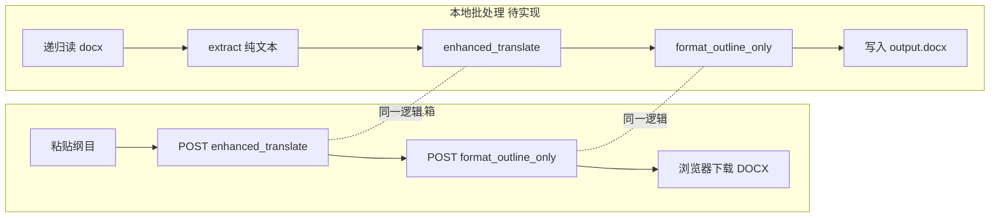

# 增强式翻译 — 批量 Word 本地脚本方案

> **文档用途**：记录「本地 Python 递归批处理 `.docx` → 增强翻译 → 输出英文 Word」的设计意向，供后续讨论与实现。  
> **状态**：方案稿（未实现）  
> **关联**：`testD/backend/enhanced_translate_service.py`、主站 `format_outline_only`、网页 `EnhancedTranslate.vue`  
> **最后更新**：2026-06-03

---

## 1. 背景与目标

### 1.1 现状（网页）

当前 **增强式翻译** 在工具箱中完成单次任务：

1. 人工粘贴中文纲目全文  
2. 点击「增强式翻译」  
3. 可选展开参考语料、下载 TXT  
4. 再点「下载 DOCX」调用 `format_outline_only`

适合**单篇、人工驱动**；不适合**几十上百篇纲目**连续处理。

### 1.2 目标（本地批处理）

增加一条 **本地 Python 入口**（建议放在 `testD/scripts/`，不增加主工程漏油），实现：

| 能力 | 说明 |
|------|------|
| 递归扫描 | 指定根目录，递归查找 `.docx` |
| 自动提交 | 无需打开浏览器、无需复制粘贴 |
| 自动落盘 | 每篇翻译完成后直接写出英文 `.docx` |
| 可批跑 | 适合培训纲目、系列纲目等批量作业 |

**核心诉求**：同一套翻译与格式刷逻辑，把「人点网页」换成「脚本一篇一篇跑」。

---

## 2. 与现有系统的关系



| 模块 | 位置 | 批处理是否复用 |
|------|------|----------------|
| 增强翻译 | `testD/backend/enhanced_translate_service.py` → `enhanced_translate()` | **是**（直接 import） |
| 纲目格式刷 / DOCX | `back_mic/backend/ai_search/ai_service.py` → `format_outline_only()` | **是** |
| Word 读写 | `python-docx`（项目已用） | **是**（读入 + 格式刷写盘） |
| 登录 / Token | `enhanced_translate_router` 的 `test_token` | **批处理可绕过**（不走 HTTP 时无需 token） |
| 路径引导 | `testD/backend/_bootstrap.py` | **是**（保证能 import 主后端） |

**原则**：业务逻辑不复制第二套；脚本只做「编排 + IO + 日志」。

---

## 3. 端到端处理流水线（单文件）

对**每一个**输入 `.docx`：

```
1. 读取 Word
   └─ python-docx 遍历段落 → 拼成纯文本（默认：非空段落用 \n 连接）

2. 校验
   └─ 空文件跳过；超长（与 API 一致 MAX_CONTENT_CHARS=100_000）报错或截断策略待定

3. 增强式翻译
   └─ await enhanced_translate(text, prompt_override=None)
   └─ 得到 result（英文纲目字符串）、refs（行级参考语料，可选落盘）

4. 格式化为 DOCX
   └─ AISearchService().format_outline_only(
         direction="zh2en",
         translated_text=result,
         output_format="docx",
         is_outline=True,
      )
   └─ 得到 docx_bytes / filename

5. 写出文件
   └─ 按约定路径保存，如 output/原相对路径/原名_en.docx
```

与网页差异：**没有**人工粘贴步骤；**可选**是否同时导出「原文+语料」TXT（与 `EnhancedTranslate.vue` 的 `buildRefsTxtContent` 类似，可二期）。

---

## 4. 批量与目录约定（建议默认值，明天可改）

### 4.1 命令行形态（草案）

```bash
# 在仓库根目录执行，PYTHONPATH 含 copypan
python testD/scripts/enhanced_translate_docx_batch.py ^
  "D:\纲目\input" ^
  -o "D:\纲目\output" ^
  --recursive ^
  --skip-existing
```

| 参数 | 含义 |
|------|------|
| `input` | 输入根目录 |
| `-o / --output` | 输出根目录（**建议必填**，避免覆盖原稿） |
| `--recursive` | 递归子目录（默认开启亦可） |
| `--skip-existing` | 若输出文件已存在则跳过 |
| `--flat` | 可选：扁平输出，不保留子目录结构 |
| `--suffix` | 输出文件名后缀，默认 `_en` 或 `_enhanced` |
| `--refs-txt` | 可选：每篇同时写 `*_refs.txt` |
| `--dry-run` | 只列出将处理的文件，不调用 API |
| `--limit N` | 只处理前 N 个（调试） |
| `-v` | 打印每篇进度 `3/50` |

### 4.2 目录映射示例

```
input/
  2024春训/
    第一篇.docx
    第二篇.docx
  单篇.docx

output/                    # --recursive 且保留结构
  2024春训/
    第一篇_en.docx
    第二篇_en.docx
  单篇_en.docx
```

### 4.3 应跳过的文件（建议）

- `~$*.docx`（Word 临时锁文件）  
- 以 `._`、`.~` 开头的隐藏文件  
- 输出目录内已生成的 `*_en.docx`（若再次扫描 input 时误扫 output，靠 `--input` 与 `--output` 分离避免）

---

## 5. Word → 纲目文本：提取规则（待确认）

网页假设输入是**已整理好的纲目纯文本**；Word 里可能是段落、制表符、软换行等。

### 5.1 默认策略（建议 v1）

```python
from docx import Document

def docx_to_outline_text(path: Path) -> str:
    doc = Document(path)
    lines = []
    for p in doc.paragraphs:
        t = (p.text or "").strip()
        if t:
            lines.append(t)
    return "\n".join(lines)
```

### 5.2 明天需讨论的点

| 问题 | 选项 |
|------|------|
| 表格 / 文本框 | v1 忽略还是报错？ |
| 多节（Section） | 是否按节分页？ |
| 页眉页脚 | 是否排除？ |
| 已有英文稿的 docx | 是否检测语言后跳过？ |
| 一篇 docx 多篇纲目 | 是否按分页符拆成多个任务？ |

---

## 6. 实现方式对比

### 6.1 方案 A：直接 import（**推荐**）

```python
# 伪代码
import asyncio
from testD.backend._bootstrap import ensure_main_backend_path
ensure_main_backend_path()
from testD.backend.enhanced_translate_service import enhanced_translate
from ai_search.ai_service import AISearchService  # 路径以 bootstrap 后为准

async def process_one(path: Path, out: Path):
    text = docx_to_outline_text(path)
    data = await enhanced_translate(text)
    if data.get("error") and not data.get("result"):
        raise RuntimeError(data["error"])
    svc = AISearchService()
    fmt = svc.format_outline_only("zh2en", data["result"], "docx", True)
    # 写 fmt["docx_bytes"] → out
```

**优点**：无 HTTP、无登录 token、易调试、与后端日志一致。  
**缺点**：需在仓库根配置好 `.env`，进程内加载 ES/Gemini 等（与起 `main.py` 相同）。

### 6.2 方案 B：调本地 API

对 `http://127.0.0.1:8000` 发请求，需 Bearer token；多一层网络与序列化。

**适用**：希望与线上行为 100% 一致、或翻译跑在远程服务器上。

**批处理默认建议**：方案 A。

---

## 7. 环境与依赖

与网页 / 方式 A 本地开发相同（见 `testD/README.md`）：

| 依赖 | 用途 |
|------|------|
| `back_mic/backend/.env` | `GEMINI_API_KEY`（**必需**） |
| Elasticsearch + `kg-rag_*` | 参考语料检索（可选，不可用则降级） |
| `OPENROUTER_API_KEY` | 稠密向量检索（可选） |
| `python-docx` | 读 docx；格式刷内部也用 |
| 模板文件 | `back_mic/backend/英文纲目模板.docx`（`format_outline_only` 需要） |

**启动方式**：不必开前端；**不必**开 testD 8010，除非用方案 B。  
脚本运行前建议：`cd D:\copypan`，`PYTHONPATH=D:\copypan`（或 `python -m testD.scripts....`）。

---

## 8. 批量运行策略

### 8.1 并发（明天定）

| 策略 | 说明 |
|------|------|
| **串行（建议 v1）** | 一篇完成再下一篇；最稳，不挤爆 Gemini 配额 |
| 有限并发 | 如 `asyncio.Semaphore(2)` 同时 2 篇；需评估 `GEMINI_SEMAPHORE` 与 ES |
| 仅翻译并发 | 检索+翻译仍按行内逻辑，文件级串行 |

`enhanced_translate` 内部已对**多行纲目**使用 `asyncio.gather`；文件级再并发会叠加压力。

### 8.2 失败与重试

- 单篇失败：记日志，**继续**下一篇（`--fail-fast` 可选停止整批）  
- 写 `batch.log` / `failures.json`：路径、错误信息、时间戳  
- Gemini 可重试逻辑已在 `_call_gemini_sync`；脚本层可对整篇重试 1 次  

### 8.3 进度与可恢复

- 终端：`[12/50] OK  2024春训/第一篇.docx → ...`  
- `--skip-existing`：输出已存在则跳过，便于断点续跑  

---

## 9. 限制与风险

| 项 | 说明 |
|----|------|
| 单篇字数上限 | `MAX_CONTENT_CHARS = 100_000`（与 API 一致） |
| 翻译质量 | 与网页相同；ES 不可用则少参考语料 |
| 费用 / 配额 | 批量 = 多次 Gemini；需自行控制篇数 |
| 格式 | 输出依赖「英文纲目模板」+ 格式刷，**不是**保留原 Word 版式 |
| 文件名编码 | Windows 路径注意中文；输出用 UTF-8 日志 |
| 耗时 | 大纲目 + 多子句检索，单篇可能数分钟 |

---

## 10. 建议的文件落点（实现时）

```text
copypan/
├── 增强式翻译_批量Word本地脚本方案.md    # 本文档
└── testD/
    └── scripts/
        ├── enhanced_translate_docx_batch.py   # 主 CLI（待写）
        └── README_batch.md                    # 简短用法（可选，实现时补）
```

**不新增主工程漏油**：脚本、文档均在 `testD/` 或仓库根方案 MD；`main.py` / `ToolBox.vue` 不改。

---

## 11. 可选扩展（非 v1）

- 同时导出 `*_refs.txt`（行级 `deduped_refs`，对齐网页「下载原文+语料」）  
- `--prompt-file` 指定附加 prompt  
- `manifest.csv`：输入路径、输出路径、耗时、warnings  
- 仅翻译不格式刷：`--text-only` 输出 `.txt`  
-  watch 文件夹（文件落地自动处理）  

---

## 12. 明天讨论清单（请逐项拍板）

1. **输出目录规则**：保留子目录 vs 扁平？默认后缀 `_en` 是否 OK？  
2. **Word 提取**：是否够用「段落 `\n` 拼接」？要不要处理表格/分页符？  
3. **并发**：v1 是否坚持**全串行**？  
4. **失败策略**：跳过继续 vs `--fail-fast`？要不要 `failures.json`？  
5. **参考语料**：批处理要不要每篇附带 `*_refs.txt`？  
6. **实现方案**：确认用 **方案 A（直接 import）** 还是必须 HTTP？  
7. **鉴权**：本地脚本是否允许无 token（仅本机、仅开发）？  
8. **输入范围**：是否只处理「文件名含纲目」或某子目录？排除模板 docx？  
9. **与作业关系**：是否写入 `testD/SUBMISSION.md` / 老师验收说明？  

---

## 13. 参考代码入口（实现时对照）

| 功能 | 文件 / 符号 |
|------|-------------|
| 增强翻译主流程 | `testD/backend/enhanced_translate_service.py` → `enhanced_translate`, `_process_line` |
| HTTP 路由（网页用） | `testD/backend/enhanced_translate_router.py` |
| DOCX 格式化 | `back_mic/backend/ai_search/ai_service.py` → `format_outline_only` |
| 网页下载 DOCX | `testD/frontend/.../EnhancedTranslate.vue` → `downloadFormatted` |
| 路径 bootstrap | `testD/backend/_bootstrap.py` |
| 环境说明 | `testD/README.md` |
| 一次性产品说明 | `CURSOR_一次性提示词_增强式翻译.md` |

---

## 14. 小结

- **可以做**，且与现有增强式翻译、DOCX 格式刷**完全同源**，适合批量。  
- **推荐**：`testD/scripts/` 下 CLI + 方案 A 直接调用 + 默认串行 + 独立 output 目录。  
- **明天**：按第 12 节拍板后，再写具体脚本与 README。
